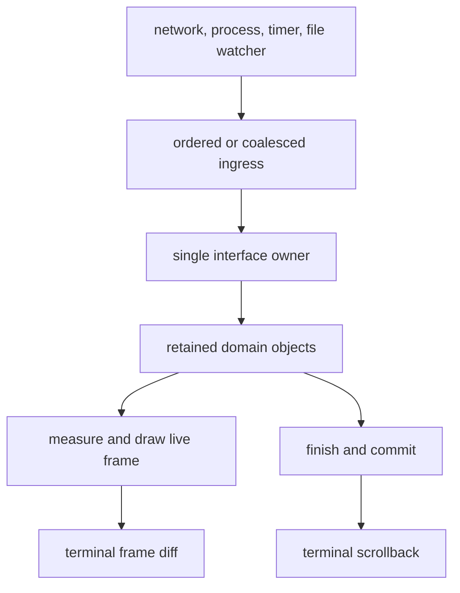
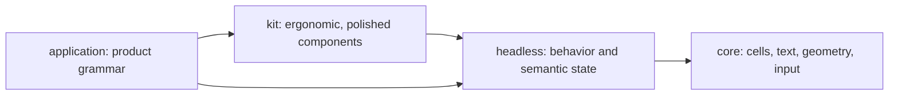
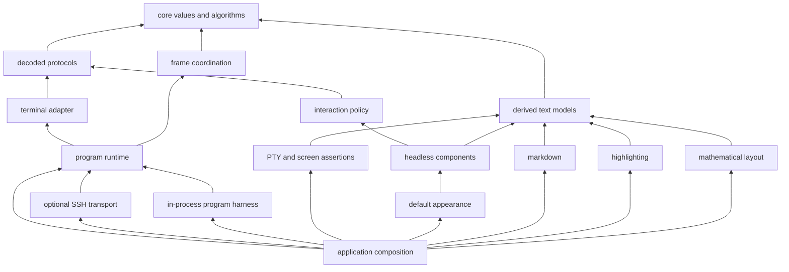

# Streaming-first architecture

Language: English | [简体中文](zh/architecture.md)

Status: target architecture and decision framework. This document describes the
direction new work must preserve; it does not claim that every mechanism described
below already exists.

The [README](https://github.com/Tangerg/oolong/blob/main/README.md) is the front door, [DESIGN.md](https://github.com/Tangerg/oolong/blob/main/DESIGN.md) explains the
current system and its provenance, and [ROADMAP.md](https://github.com/Tangerg/oolong/blob/main/ROADMAP.md) records how the
current feature set was reached. This document has a different job: it states the
long-term architecture, the boundaries that must survive implementation changes, and
the gates a proposed abstraction has to pass before it becomes public.

The words **must**, **should**, and **may** are deliberate. A must is an invariant. A
should is the default and needs a concrete reason to be violated. A may is an option,
not a roadmap commitment.

## 1. Decision

Oolong is a streaming-first terminal UI substrate for Go.

Completed output belongs to the terminal. It leaves the program's active interface,
enters scrollback, and remains useful after the program exits. The program retains
only the live, changing, or deliberately interactive part of the session. That live
part is made from ordinary mutable domain objects owned by one goroutine and projected
into clipped cell frames.

The architecture therefore has two more fundamental planes than any widget tree:

1. The **publication plane** moves finished content into terminal-owned history.
2. The **interaction plane** owns the bounded live interface that can still change.

The runtime and terminal adapter drive both planes but do not know which widgets an
application chose. Content transforms such as markdown, syntax highlighting, and
mathematical layout remain peers that produce shared text values; they do not become
runtime plugins.

Ideas from HTML, CSS, DOM, React, Vue, Solid, Flutter, Base UI, Radix UI, and shadcn are
useful where they clarify these responsibilities. They are not a reason to reproduce a
browser or a Dart runtime in Go.

## 2. Requirements and their order

When two desirable properties conflict, use this order. Correctness is assumed at
every level and is not a negotiable item in the list.

1. **Streaming first.** Long-running output must remain incremental, bounded by the
   active work rather than by the age of the session, and native to terminal
   scrollback.
2. **Architectural quality.** Extensibility, maintainability, composition, explicit
   ownership, and one-way dependencies must remain strong as the feature set grows.
3. **Good performance.** Normal interactive work must be comfortably below terminal
   latency. Optimizations must follow measurement; architectural pessimization is not
   accepted merely because no benchmark has failed yet.
4. **Clear abstraction and module boundaries.** A lower layer knows less, not merely
   different things. A boundary exists because responsibilities or dependencies
   differ, not because a diagram had another box.
5. **Ergonomic, idiomatic Go APIs.** The public surface should feel closer to
   `bytes`, `image`, `io`, and `net/http` than to a port of a JavaScript framework.
6. **Breaking changes are allowed.** The project is in its inexpensive period for
   correcting public contracts. A better contract replaces an obsolete one; the old
   path is removed.

These requirements rule out two opposite mistakes. The system must not remain simple
by forcing every application to wire the same hard problem by hand, and it must not
become elaborate in anticipation of problems no working interface has encountered.

## 3. The lifetime model

The most important state machine is not mount/unmount. It is the lifetime of output:

```text
open -> finished -> committed
```

- **Open** content may grow or otherwise change. It belongs to the program, can be
  measured again, and can be redrawn.
- **Finished** content will not change, but may still be retained because the program
  needs to search it, select it, reflow it, or keep its position in a larger
  interaction.
- **Committed** content has crossed a one-way ownership boundary into the publication
  plane. On successful delivery the terminal owns it. The live program no longer
  redraws it, rewraps it, searches it, or counts it as UI memory; a transport failure
  is settled by the rules in section 9 rather than by returning it to the component.

This is already visible in [`grid.Inline`](https://github.com/Tangerg/oolong/blob/main/core/grid/inline.go),
[`headless.Transcript`](https://github.com/Tangerg/oolong/blob/main/components/headless/transcript.go), and
[`markdown.Stream`](https://github.com/Tangerg/oolong/blob/main/markdown/stream.go). Future abstractions must preserve the same
shape rather than hiding it behind a generic collection or component lifecycle.

### 3.1 Two kinds of retained output

Terminal history and an interactive transcript are both valid, but they buy different
things.

| | terminal-owned history | program-owned transcript |
| --- | --- | --- |
| lifetime | survives the program | ends with the program unless persisted |
| memory in the program | released after publication | grows with retained content |
| resize | terminal decides reflow | program can remeasure and redraw |
| search and selection | terminal owns them | program can provide custom behavior |
| addressability | unavailable to the program | stable program coordinate space |

Retention is therefore a capability cost, not a default. An application should keep a
block only while it needs a behavior that terminal history cannot provide. Committing
it later is not an eviction trick; it is an explicit transfer of ownership and loss of
those program-level behaviors.

### 3.2 The active interface must stay bounded

The live interface normally contains a composer, an open answer or status, overlays,
and perhaps a window over deliberately retained content. It must not implicitly contain
every block ever published.

A component architecture that requires the entire session to remain mounted is
incompatible with Oolong even if it renders quickly. A resize algorithm that clears
scrollback and re-emits retained history is also incompatible: it trades the user's
terminal history and unbounded application memory for geometric certainty.
[grok-build's `xai-ratatui-inline`](prior-art.md#4-grok-build-a-counter-example-which-is-more-useful-than-a-borrowing)
ships exactly that purge-and-rerender alternative. Naming a working counter-example
does not weaken this rule; it records the real trade that Oolong has deliberately
declined.

Bounded has an operational meaning. Suppose an execution keeps `B` live or deliberately
retained blocks containing `L` bytes of payload, plus an open tail of at most `T` bytes.
After committed output has been released, the component graph must retain `O(L + T)`
payload and `O(B)` placement state, independent of the total number `N` of blocks seen
by the session. Drawing, remeasurement, and resize must follow the same live bound. A
constant-size cumulative watermark is valid; one record, closure, source slice, or
placement per committed block is not.

An application may explicitly buy `O(N)` retention for search, selection, replay, or
persistence. The type or operation that makes that choice must say so. A default
streaming composition must not make the choice on the application's behalf.

## 4. Ownership and data flow

One goroutine owns interface state. Background work may perform I/O and computation,
but it reaches the owner through a narrow dispatch edge. Background work never holds a
runtime handle that can mutate the component tree or terminal session directly.



The owner performs state transitions synchronously. A transition may request a frame,
publish finished output, start or stop an external activity, or do nothing. Frame
requests coalesce; semantic transitions do not disappear merely because several would
produce the same frame.

### 4.1 State categories

Every mutable value should clearly belong to one category:

- **Domain state** is the meaningful state of a controller or component: editor text,
  selection, open branches, validation, the current stream tail. Only the interface
  owner mutates it.
- **Derived presentation state** is recomputable: wrapped lines, measured heights,
  layout rectangles, match positions, encoded rows. It may be cached, but it is not a
  second source of truth.
- **Committed presentation state** describes the logical frame against which input is
  routed: focus, hit regions, pointer capture, and child geometry. It changes only at
  the root draw boundary described in section 6.3.
- **Published output** is no longer mutable program state.
- **Host facts** are negotiated before or around the session and exposed through
  concrete, zero-safe capability objects.

If a field cannot be placed in one category, the object probably owns more than one
concern or an implicit lifecycle has not been named.

### 4.2 `UI = f(data)` in a retained Go system

Oolong adopts functional projection without requiring immutable application models:

```text
event              -> model.Apply(action)
model snapshot      -> measure/layout
model + layout      -> frame
finished live value -> publication
```

The domain model may be a rich mutable object. Its methods enforce invariants and are
called by the one owner. Measurement and drawing are observationally pure: for the same
meaningful state, viewport, theme, and environment they produce the same result.

They may update private memoization or a last-frame geometry cache. They must not:

- start I/O or goroutines;
- advance semantic state;
- depend on being called exactly once;
- depend on sibling draw order for their meaning;
- publish output;
- call an application callback that mutates unrelated state.

This is the useful part of React's purity rule translated into a retained object
model. Local mutation of a newly built frame and invisible cache mutation are allowed;
observable state transitions during rendering are not.

### 4.3 Effects

Effects occur at explicit boundaries:

- event handlers mutate owner-held state;
- background work performs external I/O and posts results;
- runtime capability objects interact with the terminal or host;
- publication transfers finished output;
- timers enqueue coalesced callbacks and have an explicit stop path.

There is no generic effect system. `context.Context` carries cancellation and
deadlines across call boundaries; it does not become a service locator or state bag.

## 5. What is taken from frontend and Flutter systems

The value of the prior art is in separating responsibilities. The implementation
mechanisms are language- and platform-specific.

| source idea | adopt | do not import |
| --- | --- | --- |
| HTML | typed semantic roles and meaningful composition | a markup parser or stringly attribute bag |
| DOM | stable identity, parent/child paths, lifecycle, and event routing where a real tree needs them | a public mutable DOM, selectors, global listeners, or arbitrary tree mutation |
| CSS | specified values distinct from computed values; inheritance only where meaningful; state-driven appearance | textual CSS, selector specificity, class-name composition, or a style engine in `core` |
| React | one-way data flow, pure projection, minimal state, explicit identity for declarative lists | hooks, immutable-everything, render-time effects, or mandatory whole-tree reconciliation |
| Vue | a declarative view may synchronize to retained objects | proxy-based tracking, a template compiler, or hidden dependency collection |
| Solid | invalidate the smallest meaningful unit and do not recompute unrelated work | a general signal graph before measurements show it is needed |
| Flutter | distinguish configuration, retained identity, layout/paint, and platform embedding; constraints flow down and sizes flow up where a constraint layout exists | copying its class hierarchy, requiring three public trees, or rebuilding disposable descriptions every frame by default |
| Base UI and Radix UI | headless behavior, accessible interaction, compound parts, and explicit controlled/uncontrolled ownership | React Context as an API shape or boolean-prop proliferation |
| shadcn | an ergonomic, polished component layer over headless primitives: coherent defaults, convenient composition, and themeable finished appearance | source-copy distribution as an architectural requirement, generated ownership, or product grammar in the shared library |

The references behind these distinctions are the [DOM Standard](https://dom.spec.whatwg.org/),
[CSS Display](https://www.w3.org/TR/css-display-4/),
[React's rendering purity](https://react.dev/learn/keeping-components-pure),
[Vue's rendering model](https://vuejs.org/guide/extras/rendering-mechanism),
[Solid's fine-grained reactivity](https://docs.solidjs.com/advanced-concepts/fine-grained-reactivity),
[Flutter's architectural overview](https://docs.flutter.dev/resources/architectural-overview),
[Radix Primitives](https://www.radix-ui.com/primitives/docs/overview/introduction),
[Base UI](https://base-ui.com/react/overview/about), and
[shadcn/ui](https://ui.shadcn.com/docs).

### 5.1 Responsibilities before object graphs

Flutter's Widget, Element, and RenderObject are useful names for three different
responsibilities:

1. What an interface should contain.
2. Which live instance owns identity and lifecycle.
3. How it is measured, hit-tested, and painted.

Oolong must keep those responsibilities distinguishable. It does not follow that the
repository needs three exported interfaces, three packages, or three object graphs.
A retained Go component instance owns behavior. Identity across collection rebuilds
must be explicit — a keyed slot or an opaque handle — rather than inferred by comparing
open interface values. A separate Element tree is justified only if a declarative
description layer creates a real need to reconcile disposable descriptions with
persistent instances.

Until then, adding one would be speculative indirection.

### 5.2 Declarative composition is optional, not foundational

A future high-level API may allow a pure function to describe a live subtree and use
stable keys to reconcile it. Such an API belongs above retained components and must
lower into the same measurement, event, and frame path. It must not become a dependency
of `grid`, `layout`, `term`, `present`, or `program`.

It earns a public API only after at least two real interfaces demonstrate that manual
synchronization of conditional or reordered component trees is a recurring source of
errors. Allocation cost, identity rules, focus preservation, and stream lifetime must
be benchmarked and specified before adoption.

### 5.3 The component ladder

The component system has four levels with one-way dependencies:



`headless` is the Base UI/Radix-like layer. It owns controllers, compound parts,
controlled and uncontrolled state, keyboard and pointer policy, focus rules, and typed
semantics. It does not choose the application's colors, glyphs, spacing, or product
language.

`kit` is the shadcn-like layer in the sense relevant to Oolong: it makes the headless
parts easy to use and good-looking out of the box. It may compose several headless
parts, provide strong defaults, apply a coherent theme, and expose a shorter common
call site. It remains normal imported, versioned Go library code; source copying and a
generator are not part of the architecture. A caller must still be able to reach the
underlying controller and semantic parts when the default composition is not enough.

Application code owns product grammar such as an approval flow, model answer, command
palette contents, or deployment status. Shared components may provide the dialog,
list, editor, table, and status primitives used to express that grammar, but must not
name or encode the product decision itself.

## 6. Composition model

Composition is primarily object composition and small capability method sets.

The current narrow roles are sound:

- a drawable writes into an already positioned and clipped view;
- a measurer reports the size it needs under the relevant constraint;
- an interactive value may consume an event;
- a focusable value is explicitly told when keyboard ownership changes;
- a doer exposes named actions independently of key bindings.

New behavior must not be added to a universal base interface merely because several
widgets can implement it. The consumer that needs an optional capability declares the
small interface locally. Concrete types remain the normal values callers construct and
receive.

### 6.1 Rich controllers and compound parts

Complex headless components should have one concrete controller that owns their state
machine and exposes meaningful operations. Visual or structural parts compose around
that controller.

A dialog, for example, conceptually has a root, trigger, content, title, description,
actions, and close operation. In Go these do not need React namespaces or Context.
They may be concrete values or functions created from a `*Dialog` controller, with
small locally declared interfaces where substitution is real.

This structure should replace configurations that grow through unrelated booleans.
Mutually exclusive variants should be separate constructors, concrete types, or
explicit values. A boolean is appropriate for independent state, not for choosing one
of several component kinds.

### 6.2 Controlled and uncontrolled state

Reusable headless components need two valid ownership modes:

- **Uncontrolled:** the component owns local state and provides the simplest useful
  zero or constructor-created value.
- **Controlled:** the caller supplies storage or a binding because several components
  coordinate around the same value.

The distinction must be visible in construction or in the bound value, not hidden
behind `Controlled bool`. Existing typed accessors are a useful pattern when the
component genuinely edits caller-owned data. A component must not keep a private copy
of controlled state that can drift from its owner.

### 6.3 Layout and committed geometry

`core/layout` remains pure geometry. It divides sizes and returns rectangles; it does
not learn about widgets, focus, themes, or event routing.

Containers may combine layout and routing because those responsibilities share the
same committed geometry. The boundary to protect is between meaningful component
state and derived geometry, not between two functions that always change together.

Visual chrome has two legitimate composition shapes, selected by ownership rather
than taste. Passive chrome such as `kit.Box` paints a region and returns its interior;
it can frame a string, a block, a widget, or nothing because it owns no child and
participates in no routing lifecycle. A live wrapper such as `kit.Panel` owns one
focusable child, stages the interior rectangle with the root frame, translates pointer
coordinates, and forwards keyboard ownership. The child type is deliberately narrowed
to the capability the wrapper exposes: a general wrapper must not make a passive child
appear focusable merely because Go cannot conditionally add methods to a type.

Input must be routed against the geometry of the last completed logical frame. Here,
"completed" means that the root `Draw` used to construct the frame has returned and the
frame has been handed to the presentation pipeline; it does not mean that the terminal
transport has acknowledged every byte.

Drawing is the geometry transaction. Routing-relevant layout is written into a pending
snapshot while the component tree draws. The component composition root swaps the
whole pending snapshot into committed state only after the complete root draw returns.
`Handle` reads only the committed snapshot. An event arriving before that swap sees the
previous frame; an event arriving after it sees the new one. No child may publish its
new hit regions early.

The implemented boundary is deliberately small. A live `headless.Widget` draws into a
`headless.Frame`, which embeds its clipped `grid.View` and carries the root transaction
through `Sub` and `Subs`. `headless.Root` is the only adapter to the runtime's
consumer-defined `program.Component`; it commits every nested `Snapshot` after the
whole tree returns and aborts pending state if drawing panics. `Scroll.Stage` and
`Transcript.Stage` apply the same transaction to derived viewport bounds and transcript
reflow, so those lower reusable models do not publish a new coordinate space early.

Passive completed content is a different contract: a `headless.Block` draws directly
into a `grid.View`, measures itself, and owns no routing geometry. `headless.Static` is
the explicit bridge when a block must appear inside a live widget tree. A passive block
that needs a geometric query takes the relevant constraint as an argument; it does not
write an invisible hit map during drawing.

This transaction belongs to the component side of the dependency graph. The runtime
only invokes `Draw` and `Handle`; it does not call back into `headless` to announce that
a frame was accepted, and `headless` does not import `program`, `present`, or terminal
packages. Slice 2 must prove the smallest component-owned drawing scope needed to stage
and swap nested geometry without creating a second tree or a reverse dependency.

Pointer capture belongs to the interaction that began it and continues until release
or removal of the target.

A general constraint object with minimum and maximum width and height may be introduced
if wrapper composition, bidirectional sizing, or multiple layout strategies cannot be
expressed cleanly through the existing measurer contract. It must be proven by a
complete component, not added solely because Flutter has one.

### 6.4 Style and semantics

Headless behavior exposes semantic state such as focused, selected, disabled, invalid,
or open. It does not select colors or glyphs. An appearance layer maps semantic roles,
parts, and state to terminal presentation.

If fixed theme fields cease to scale, the next step is a typed rule resolver, not CSS
syntax. Its precedence should remain short and explainable:

```text
library default < application theme < subtree scope < instance override
```

Only properties with natural inheritance, such as a default text style, should inherit.
Layout values, focusability, and behavior do not become style merely because CSS can
express some of them.

Semantics are useful even without a browser accessibility tree. A typed semantic
projection can drive spoken forms, structural tests, inspection tools, automation, and
future host integrations. Decorative render objects may disappear from that projection;
one semantic control may also be rendered by several boxes. This is another reason not
to equate component identity with cell geometry.

## 7. Modules, packages, and dependency direction

The existing module rule remains the default: create a module when a genuinely
different dependency set or independently versioned extension justifies the cost.
Do not split a module to make an architecture diagram symmetrical.

The semantic dependency graph is:



Peer content modules compose through a consumer-owned semantic-block seam, not by
importing one another. Markdown owns syntax recognition and exposes stable meanings
such as fenced code and display mathematics; renderers receive only info strings,
source, and `core/text` values. Goldmark nodes, LaTeX AST nodes, Chroma lexers, and
their configuration never cross module boundaries. A future Markdown syntax
extension must preserve that direction instead of turning an implementation parser
into the public plug-in protocol.

`program` remains orthogonal to the widget ladder. It drives a consumer-defined
component method set and must not import `components`. Conversely, components do not
know which terminal host, scheduler, or runtime drives them.

The SSH transport is an optional module above `program`, not another runtime and not
an edge inside `core`. It adapts a session already accepted by the application's SSH
server; authentication, listening, host keys, connection policy, logging and exit
status remain application concerns. Its external dependency is therefore paid only
by applications that import the adapter.

### 7.1 A package must earn its name

A new package should satisfy all of these questions:

1. Can its responsibility be stated in one sentence without using `common`, `util`,
   `service`, `manager`, or another positional word?
2. Does it own a coherent set of concrete behavior rather than one interface and a
   collection of forwarding adapters?
3. Do at least two real consumers need the boundary?
4. Does the boundary remove knowledge from the lower side or isolate dependencies?
5. Can imports continue to point one way without a callback registry or service
   locator hiding the reverse edge?

If not, the code stays with the domain that owns it.

A shared active-tree substrate may eventually earn a package under the `components`
module if both built-in headless components and independent third-party components need
it. It does not earn a new module while its dependency set and release lifecycle remain
the same. Package creation follows the demonstrated boundary; it does not precede it.

### 7.2 Lower layers remain general

Lower packages may know about bytes, cells, grapheme width, rectangles, decoded input,
and frame timing. They must not know about dialogs, selected rows, validation, command
palettes, themes, or model answers.

A lower abstraction is general because its contract is complete in its own vocabulary,
not because it accepts `any`, maps of properties, or callbacks for everything it could
not decide. A generic escape hatch that merely moves upper-layer knowledge into strings
is an abstraction leak.

The copy/search boundary demonstrates the direction. A visual text row is now
`core/text.Row`: meaningful text, its rendered column offset, and reversible wrap
metadata. `markdown`, `latex`, and `components` can produce it without learning one
another's vocabulary. Transcript selection and search consume that lower value;
gutters, markers and component identity do not leak into copied text.

Architecture tests continue to enforce imports, documentation references, module
dependency promises, graph completeness, and acyclicity. A new ring is added as one
node with its direct lower dependencies.

## 8. Streaming ingestion and backpressure

Streaming-first output starts before the interface owner. Network readers, subprocess
pipes, and filesystem watchers often produce from background goroutines. Treating every
chunk as an unrelated dispatched closure is correct but can create excessive queue
objects and unbounded lag.

Ingress has three semantic classes:

| class | examples | required policy |
| --- | --- | --- |
| lossless ordered data | text chunks, process output, protocol records | preserve order, batch adjacent data, and apply backpressure rather than drop |
| replaceable state | progress percentage, latest dimensions, latest query result | keep the newest value and coalesce obsolete work |
| discrete transitions | completion, error, approval, command result | preserve every meaningful transition in order |

Frame requests are replaceable signals. Text chunks are not. Treating both the same
either wastes work or loses data.

`Dispatcher.Post` remains the general, non-blocking ownership edge. It must not be
silently changed into a bounded queue that can block the owner behind work only the
owner can consume. A higher-level stream ingress may batch or bound producer data, but
it must specify:

- whether writes may block and how cancellation stops them;
- which values may be coalesced;
- how order is preserved;
- what happens when the consumer exits;
- which goroutine invokes the consumer;
- whether an error or final partial chunk is delivered before close.

[`program.ByteIngress`](https://github.com/Tangerg/oolong/blob/main/core/program/ingress.go) is the deliberately narrow result
proven by the subprocess example. It accepts lossless bytes, blocks the producer when
its explicit pending-byte limit is full, batches adjacent writes behind at most one
owner task, delivers completion or failure after accepted data, and stops with its
dispatcher. It creates no second owner loop and does not change the non-blocking
`Dispatcher.Post` contract.

That proof does not justify a generic mailbox, observable, typed stream, or policy for
the other two semantic classes. Those abstractions still require complete callers of
their own.

### 8.1 Incremental transformation

A streaming transform must avoid work proportional to all content seen so far on every
chunk. It should separate a stable prefix from a short open tail:

```text
new chunk -> scan new material -> publish newly stable prefix -> rerender open tail
```

`markdown.Stream` is the reference shape. A decoder may retain incomplete protocol
syntax and style state; a renderer may retain the open block; neither retains published
source merely for convenience.

### 8.2 Publication guarantees

Publication is ordered and lossless:

- a partial row may remain open across chunks;
- a whole-row publication closes a previously open row first;
- empty chunks publish nothing;
- a failed write does not silently discard pending output;
- shutdown publishes or deliberately abandons the final tail according to an explicit
  caller action;
- `Run` does not return before accepted terminal output is drained or an error reports
  that it was not.

The terminal may reflow its history on resize. Oolong does not retain and replay all
history to simulate control the terminal has not offered.

## 9. Failure and degradation model

The publication path is ordered, externally visible, and partly irreversible. Its
failure contract is therefore part of the architecture, not an implementation detail.
The system must distinguish an absent optional capability, a source-level failure the
interface can represent, and a broken session that can no longer preserve output
ownership.

### 9.1 Failure domains

| domain | required behavior |
| --- | --- |
| optional host discovery | Absence, an unanswered probe, or a stale nonessential fact degrades to a documented conservative value. It is not reported as an operation failure. |
| source or transform | Completion and failure enter the owner as ordered semantic transitions. The application may render the failure and may still commit earlier stable output. |
| input transport | A clean end closes the session normally. A transport that knows it failed must preserve and expose the cause; `Run` must not turn a known non-cancellation failure into success. |
| frame construction | Drawing mutates only an in-memory pending frame and pending geometry. Library code does not swallow panics from application code or pretend a partial logical frame was committed. |
| output transport | The first failed terminal write is fatal for that session. Later frames are not attempted, and `Run` returns an error preserving the write cause. |
| teardown | Cancellation stops producers, accepted frames receive the documented drain grace, and terminal restoration is attempted even after another failure. Independent errors are joined. |

The core does not invent logging, retry, reconnection, or persistence policy. Those
belong to the host or application because only it knows whether a new transport is the
same session and whether replay is safe.

### 9.2 Publication outcomes

The frame queue taking ownership of immutable bytes is **acceptance**. The output
transport successfully consuming the whole frame is **delivery**. Committing a live
block transfers it to the publication plane, which may release the component payload;
the publication plane then owns enough immutable data to deliver it or report failure.

A terminal or SSH transport can fail after writing an unknown prefix. That outcome is
ambiguous: Oolong cannot know which cells the user saw. It must not silently retry the
frame, replay committed history into a new session, or claim exactly-once delivery. It
stops publication, accounts for queued work, returns the causal error, and restores the
terminal as far as the transport permits. A caller may start a new session and rebuild
live state, but that is a new ownership decision.

Normal cancellation is not itself a failure. It still waits the documented bounded
grace for accepted output. A drain timeout, refused handover, or writer error is a
failure even when shutdown was otherwise requested, because returning success would
falsely claim that display ownership had settled.

### 9.3 Degradation rules

Degradation may reduce fidelity, never correctness:

- unknown ground, color depth, cell pixels, or optional protocols use documented safe
  defaults or report unsupported;
- a missing image, clipboard, notification, or shell-integration capability remains
  visible to the layer that can choose a textual or inert fallback;
- invalid or stale dimensions are normalized to a safe empty/minimal geometry or
  reported as an error; they do not cause a panic or input-sized allocation;
- appearance may substitute glyphs, colors, or borders while headless behavior and
  typed semantics remain intact;
- lossless data is never reclassified as replaceable merely to keep the interface
  responsive.

Fallbacks must be local and explicit. A lower package reports the fact it knows; it
does not guess the product-level substitute.

Window size is session-critical input, not optional discovery. On every supported
platform, a size change after opening must eventually enter the same ordered input
stream as the opening `Resize`. A native signal is preferred. Where the platform has
no independent signal, the terminal adapter must poll or synthesize changes without
creating a second owner of the input handle. Observations may be coalesced because
dimensions are replaceable state, but the newest observed size must not be lost. A
platform with neither a reliable signal nor a bounded, stoppable observer is not a
supported terminal host.

How often an observer samples is policy owned by the platform file, not part of this
invariant. A fixed interval is the simplest form and is the current one. An observer
may also widen its interval while nothing changes and restore it on the first change,
provided it stays bounded, still reports the newest size, and still stops with the
session. What the observer must not become is a general scheduler, a shared clock, or
a reason for the loop that reads it to learn which platform it is on: the sampling
loop takes its clock as an argument so that this policy can change in one platform
file and be proved with a deterministic one everywhere.

## 10. Executable architecture

An invariant that code can violate needs an executable guard. Prose explains the
reason and the boundary; tests, static checks, or release checks make the boundary
fail visibly. A vertical slice is not complete until it adds the guard for every
invariant it makes enforceable.

| invariant | executable evidence | gate |
| --- | --- | --- |
| dependency direction and vocabulary | `internal/arch` derives forbidden imports from the declared DAG and checks module promises, documentation references, completeness, and cycles | every CI run |
| a centralized primitive stays centralized | `dupl` rejects a second structural copy of the extent, coordinate, writer, identity and ANSI framing primitives beside the first. It runs per module, so a copy in another module is outside its reach and stays a reading | every CI run, within a module |
| bounded live lifetime, section 3.2 | a deterministic component test proves that commit removes strong payload references and per-block placement records; a fresh-process stress test compares `N` and `2N` large committed streams after GC and rejects retained-heap growth proportional to `N` | required by slice 1 and every transcript implementation |
| incremental lossless ingress | burst, cancellation, close, partial-tail, and producer-faster-than-consumer tests prove ordering, batching, the declared bound, and the absence of drops | required by slice 1 |
| observationally pure measurement and drawing | [`headless`](https://github.com/Tangerg/oolong/blob/main/components/headless/draw_purity_internals_test.go), [`kit`](https://github.com/Tangerg/oolong/blob/main/components/kit/draw_purity_internals_test.go), [`markdown`](https://github.com/Tangerg/oolong/blob/main/markdown/draw_purity_internals_test.go), and [`latex`](https://github.com/Tangerg/oolong/blob/main/latex/draw_purity_internals_test.go) classify every production `Measure` and `Draw*` receiver; every stateful receiver measures and draws twice from the same meaningful state, preserves its semantic projection, returns the same extent, and produces identical terminal bytes, styles, and cursor state | every package that implements measurement or drawing; an unclassified receiver fails |
| one-frame routing geometry, section 6.3 | a routing test observes the old snapshot while a new root draw is staged, then the complete new snapshot after the root commit; no mixture of child geometries is observable | required by slice 2 |
| supported-platform resize delivery | a real Unix PTY changes geometry and must produce the later `Resize`; the Windows polling state machine is tested with a deterministic clock for change detection, error recovery, deduplication, and shutdown; Windows sources build and test in CI | every terminal test run and every supported OS source set |
| idle rendering and publication work is zero | [`TestAnIdleProgramStopsWriting`](https://github.com/Tangerg/oolong/blob/main/core/program/program_test.go) and timer tests prove no unconditional frame clock or repeated bytes; a platform observer that must sample external state is bounded, emits nothing for an unchanged observation, and stops with the session | every CI run |
| failure and ownership settlement | [`program` fault tests](https://github.com/Tangerg/oolong/blob/main/core/program/program_test.go) cover input cause, invalid or excessive host geometry before allocation, partial output, no later writes, drain timeout, and capability absence; [`term` fault tests](https://github.com/Tangerg/oolong/blob/main/core/term/terminal_test.go) cover real-PTY teardown and [`Writer`](https://github.com/Tangerg/oolong/blob/main/core/term/writer_test.go) covers short/partial writes and bounded close | required by slice 1 and each new host |
| public module compatibility | every module builds without `go.work`; the release workflow runs the pinned `golang.org/x/exp/cmd/gorelease` against the preceding immutable module tag, reporting pre-1.0 changes and rejecting a proposed v1+ tag that violates Go compatibility; ordinary CI checks the declared Go floor and supported source sets | manual release check before tagging and every public module tag |

The bounded-memory gate deliberately has two parts. Internal reference and record
counts are deterministic and are the primary proof. The black-box heap test runs in
fresh processes with payloads large enough to dominate runtime noise; it validates the
architectural consequence without making an absolute allocation count the contract.
Benchmarks and long-running soak tests provide trend evidence, but do not replace the
deterministic guard.

Third-party program tests use [`programtest`](https://github.com/Tangerg/oolong/tree/main/core/programtest), an in-process host
above the runtime in the enforced dependency DAG. Its base Host implements only the
three required transport methods. Tests add optional terminal capabilities by embedding
it in a local type, so the public harness does not make capability absence impossible
to exercise. The examples consume this public package; no private fake is a hidden
prerequisite for reproducing their tests.

Not every semantic rule can be inferred by a repository-wide static test. Where
enforcement is necessarily a test pattern, the slice that introduces a component or
host must instantiate that pattern. Reviewers should reject a new `must` whose failure
cannot be observed and whose planned enforcement is unnamed.

## 11. Performance model

Performance is a design constraint, not the organizing principle.

The desired complexity is:

- memory proportional to the live interface plus content the application explicitly
  retains, not to content already committed;
- amortized work proportional to each incoming chunk plus the short open tail;
- drawing proportional to the active viewport and visible components, not session age;
- resize proportional to active retained content, never terminal-owned history;
- an idle interface doing no drawing or publication work, writing no bytes, and
  running no unconditional frame clock; a platform that cannot signal required
  external state may use one bounded observer that emits only changes and stops with
  the session;
- at most one pending tick per timer;
- repeated measurement or wrapping avoided when the inputs have not changed.

No promise is made that every frame allocates zero bytes or that every update touches
one cell. Terminals are slow relative to ordinary Go code, and clarity is worth small
constant costs. The following are still architectural smells even before profiling:

- quadratic growth with transcript length;
- whole-history redraw or retention;
- a goroutine or ticker per passive component;
- reflection or string-keyed dynamic dispatch in the frame path;
- rebuilding a disposable object tree on every token without evidence;
- layout algorithms with unbounded or input-dependent recursion over untrusted data.

### 11.1 Measurement before optimization

Benchmarks should answer product questions:

- How does a one-hour stream affect memory after completed blocks are committed?
- What happens when a producer bursts faster than frames can be shown?
- What is the cost of updating one open markdown block?
- What does parsing one representative mathematical expression allocate?
- How much work does an unchanged frame do and how many bytes does it write?
- What does resize cost for a large deliberately retained transcript?
- Do wide graphemes, combining marks, links, and images preserve their invariants?

Each question has a named, reproducible observation rather than an implied future
benchmark:

| product question | executable evidence |
| --- | --- |
| committed stream lifetime | `BenchmarkTranscriptCommittedStream` measures steady-state transfer cost as session age grows; the deterministic release and fresh-process heap tests remain the retention proof |
| producer burst | `BenchmarkByteIngressProducerBurst` reports throughput, allocations, and owner batches at two explicit pending-byte limits |
| open markdown update | `BenchmarkOpenMarkdownUpdate` holds the open-tail size constant at three scales; `BenchmarkOpenMarkdownCachedRead` separates the defensive result copy from parsing |
| mathematical layout | `BenchmarkRender` parses and lays out a representative fraction, radical, relation, and scripts once; frames reuse the immutable result and are covered by the purity gate |
| unchanged frame | `BenchmarkFrameThatChangedNothing` reports wire bytes per frame as well as work and allocations |
| retained transcript resize | `BenchmarkTranscriptRetainedResize` alternates widths through the real root-frame transaction at 100 and 10,000 retained blocks |
| complex cell invariants | `BenchmarkComplexFrameThatChangedNothing` combines wide and combining graphemes, links, styles, and a painted region, and reports wire bytes; correctness remains in the focused grid and text tests |

These benchmarks intentionally have no machine-time thresholds in CI. Their stable
contracts are the scenario, scale, and semantic metrics such as wire bytes and batch
counts. Nanoseconds and allocation totals are evidence to compare before and after a
change, not portable correctness claims.

Use benchmarks, allocation reports, traces, and profiles to choose optimizations. Keep
the straightforward implementation until evidence identifies a hot path. An
optimization that complicates a public contract needs stronger evidence than one hidden
inside an implementation.

## 12. Go API rules

Public APIs follow these rules:

1. **Concrete domain objects are entry points.** `Runtime`, `InlineRuntime`,
   `Transcript`, `Editor`, and similar values own coherent behavior.
2. **Interfaces are declared by consumers.** They contain the smallest method set the
   operation needs.
3. **Accept interfaces and return concrete values.** Callers should not need type
   assertions to discover standard capabilities.
4. **Useful zero values are preferred.** A zero value is inert or ready; it is not
   half-initialized. Constructors exist when invariants, resources, or required data
   make one necessary.
5. **Absence and failure are different.** An unsupported optional capability can have
   a documented no-op or false result; an attempted operation that could not preserve
   its contract returns an error.
6. **Variants are explicit.** Root and inline runtimes are different concrete types
   because only one can publish to scrollback. Avoid mode booleans that make half an
   API meaningless.
7. **State transitions are methods.** Rich objects protect their own invariants instead
   of exposing fields that callers must update in a coordinated order.
8. **Configuration stays proportional.** Plain fields are appropriate for simple
   declarative values. Functional options are reserved for genuinely complex
   initialization, not used as ceremony around every constructor.
9. **Names rely on package context.** Prefer `grid.View`, `layout.Flow`, and
   `program.Run` to names that repeat their package.
10. **Callbacks have one purpose.** If a callback accumulates lifecycle rules, errors,
    cancellation, and optional behavior, replace it with a named domain object.
11. **Errors add operational context and preserve causes.** Do not log and return the
    same error inside library code.
12. **No global mutable service state.** Themes, host services, clocks, and resources
    are explicit values.
13. **Generics remove repeated algorithms.** They do not create a component type
    hierarchy or a universal state container.
14. **One obvious path.** When a new contract replaces an old one, update callers and
    remove the obsolete route.

API ergonomics are evaluated at call sites in examples, not only at declarations. The
shortest useful streaming program and the most demanding composition should both read
linearly without hidden global setup.

## 13. Breaking-change and release policy

Pre-1.0 is the time to correct ownership and abstraction boundaries.

A breaking architectural change must be atomic across this repository:

- introduce the final contract;
- update all modules, examples, tests, and documentation in the same change;
- remove obsolete types, fields, constructors, and code paths;
- remove tests that prove only the obsolete behavior;
- do not add deprecated aliases, compatibility adapters, feature flags, migration
  modes, or fallback dispatch;
- record the new contract and its reason.

Published module ordering may require tags to be released from lower dependencies to
higher ones. All public Oolong modules are published as one coordinated release train,
with the same version and release notes. During pre-1.0, users must upgrade that set
together when a release changes a cross-module contract. The source tree and standalone
module checks must be green before the first tag is created; no module may depend on an
unpublished workspace-only shape. This release concern does not justify keeping two
runtime contracts in the source tree.

Breaking change is permission to improve a contract, not permission to churn it. A
proposal still needs a durable ownership model, real call sites, and an end-to-end
implementation plan before the old path is removed.

### 13.1 The v1 compatibility boundary

Version 1 changes the policy. Each public module then promises Go 1 compatibility on
its own: exported names are not removed, signatures do not change, methods are not
added to exported provider interfaces, documented zero-value, error, ownership, and
concurrency behavior remains valid, and an incompatible redesign requires a new major
module path. The coordinated train may still publish all modules together, and users
should normally upgrade the set together, but correct `go.mod` minimums must allow any
mixed v1 minor versions that satisfy the declared dependency graph.

Pre-1.0 ends only when all of the following are true:

1. Slices 1 through 3 in section 15 are complete; slices 4 and 5 are either unnecessary
   or demonstrably additive.
2. The known invariant-violation list in section 14 is empty, and the bounded-lifetime,
   presentation-snapshot, idle, failure, race, architecture, and supported-platform
   gates run in CI.
3. The canonical streaming composition and at least two independently maintained,
   non-example applications have shipped against a release candidate without needing
   an incompatible contract change during its stabilization.
4. Every exported identifier in every public module has an ownership, zero-value,
   error, concurrency, and dependency-direction review. Public API baselines are
   established by the immutable module tags, and the pinned `gorelease` release check
   compares every proposal against its preceding baseline.
5. Each module builds and tests at its declared Go floor with `GOWORK=off`, release
   order is rehearsed from dependency leaves upward, and the upgrade set is documented.

These conditions are the exit from the breaking-change period, not aspirations for
some later v1.x. A capability that can be added compatibly may remain out of v1; an
unsettled ownership or lifetime contract may not.

## 14. Current conformance and capability gaps

Most of the existing foundation already points in this direction: inline publication,
bounded transcript release, causal input streams, bounded byte ingress, fault-injected
ownership settlement, atomic component-side presentation snapshots, transactional
scroll and transcript reflow, the live-widget/passive-block distinction, the one-owner
runtime, compound dialog and tabs controllers, structural component semantics,
incremental markdown, clipped cell views, cross-platform resize observation, bounded
host-controlled geometry,
consumer-defined capabilities, a minimal public in-process program host, live framed
single-child composition, executable drawing-purity classification, release API checks,
and the enforced dependency DAG are assets to preserve.

### 14.1 Known invariant violations

These contradict a `must` in this document and must be empty before v1:

- None currently known. New violations belong here immediately; this empty list is a
  testable release condition, not a claim that future audits cannot find one.

### 14.2 Missing capabilities and proofs

These are not current invariant violations. They are capabilities or end-to-end proof
the system still needs:

- None currently known. Optional slices remain conditional; they are not missing v1
  foundations until their stated evidence demonstrates the need.

These are not invitations to independent framework-building refactors. Each item is
owned by a named slice below so that the fix lands with its real caller, tests, and
final ownership model.

## 15. How the architecture grows

Work proceeds in vertical slices. Each slice leaves a working, tested product and adds
one final-direction capability. No phase creates an unused framework for a later phase
to justify.

| slice | closes or proves | completion evidence | v1 status |
| --- | --- | --- | --- |
| 1 | committed-payload retention, input failure, bounded stream ingress, end-to-end failure semantics | canonical stream, retention gates, fault host, PTY | complete (required) |
| 2 | atomic committed geometry and presentation-state ownership | old/pending/new routing snapshot test across nested components | complete (required) |
| 3 | compound headless ownership, shared semantics, and polished `kit` composition | the same pattern proven by two controls | complete (required) |
| 4 | typed computed appearance, only if fixed themes stop scaling | two unrelated controls and one application override | optional and additive |
| 5 | declarative authoring, only if real synchronization bugs justify it | two real applications, identity and lifetime specification, benchmarks | optional and additive |

### Slice 1: bounded streaming publication and failure semantics

Build or extend a worked interface that combines:

- background incremental input;
- an open markdown or styled-text tail;
- publication of stable blocks to scrollback;
- a retained transcript where interaction is intentionally required;
- a composer;
- focus and pointer routing;
- an overlay such as an approval dialog;
- resize and cancellation;
- a real PTY test;
- a fault-injected host covering source failure, input close, partial terminal write,
  drain timeout, capability absence, and teardown.

This is the architecture probe. Any new abstraction must make this interface simpler
without teaching lower packages what a chat, model, approval, or command is.

`Host.Input` returns one causal `EventSource`: channel closure is followed by
an `Err` result, so clean EOF and known transport failure stay distinct without
coupling `program` to a concrete host. `ByteIngress` now supplies the lossless byte
policy: its subprocess caller proves batching, a pending-byte bound, producer
backpressure, ordered completion and failure, and owner cancellation without changing
general dispatch.
`Transcript.Commit` already physically releases committed payload and per-block
placement records while preserving an aggregate live coordinate base; its deterministic
retention test and fresh-process `N` versus `2N` GC test are gates this slice must
keep green. Fault injection covers source and input failure, an
ambiguous partial output write, no writes after failure, drain timeout, capability
absence, bounded close, and best-effort real-terminal teardown.

This slice is complete. [`examples/streaming`](https://github.com/Tangerg/oolong/tree/main/examples/streaming) is the single
canonical path rather than a parallel showcase: approval transfers focus before the
source starts; the source writes only through `ByteIngress`; `markdown.Stream` turns
the changing suffix into stable blocks; and `Transcript.CommitN` transfers only the
excess finished prefix while retaining a fixed recent window for selection, pointer
and scroll interaction. Cancellation is a distinct domain result from source failure,
and teardown cancels the source through ingress ownership. Deterministic example tests
prove approval ordering, stable/open transitions, the retention bound, accepted bytes
before failure, and cancellation. Component tests prove wheel and selection routing;
the real-PTY suite proves resize, idle silence, mode restoration, scrollback survival
and the complete approval-to-publication path. The program and terminal fault suites
remain the executable evidence for input close, ambiguous partial writes, drain
timeout, missing optional capabilities and independent teardown attempts.

### Slice 2: remove presentation-state leakage

Identify geometry, focus, or hit-test state duplicated by two or more components.
Move only the demonstrated common responsibility to its durable owner. Presentation
snapshots must be committed coherently with frames, and domain objects must not depend
on a partially built layout.

The component composition root stages a pending routing snapshot during `Draw` and
swaps it after the root draw completes. The runtime receives no component-specific
callback. The old/new snapshot test in section 10 is the completion condition. This
slice may remain inside `headless` if no independent package boundary has been earned.

This slice is complete. `Root`, `Frame`, and `Snapshot` provide the component-owned
commit boundary; containers, stacks, fields, lists, editors, viewports and dressed
controls route through it. `Scroll.Stage` and `Transcript.Stage` keep viewport bounds
and width-dependent transcript placement on the same transaction. The required nested
test changes both an outer and inner layout, routes an event during drawing to the old
pair, observes the new pair after commit, and proves that either mixed pair is
unobservable. Panic tests prove that pending values and references are released while
the previous frame remains current.

### Slice 3: compound headless controls

Use one complex control such as dialog, select, or form to establish:

- controller ownership;
- compound parts;
- controlled and uncontrolled construction;
- semantic state;
- focus restoration;
- appearance injection without behavior depending on `kit`.

Then apply the pattern to a second control. Only the shared result is generalized.
For each control, `kit` must also provide one polished, themeable, short-call-site
composition over the headless parts. This is where the shadcn lesson is proven: better
defaults and ergonomics, not source copying and not product-specific behavior.

This slice is complete. `headless.Dialog` owns one modal state machine; its content and
trigger are compound parts, every close path settles controlled or local open state,
and `Stack.Remove` can close a covered dialog without dismissing a newer layer. Focus
tests prove that opening removes keyboard ownership from the base and every dismissal
restores it. `headless.Tabs` owns its tab parts and controlled or local selection;
owner-written controlled state is applied through an explicit `Sync`, so drawing never
performs a hidden focus transition. Both controls project the same typed `SemanticNode`
tree without exposing visual boxes. `kit.NewDialog` and `kit.NewTabs` are the polished,
themeable short path while their controller and appearance parts remain reachable.
Structural tests cover roles, selected/open/focused state and the two ownership modes.
`kit.Panel` closes the separate composition gap between passive chrome and a live child:
it preserves the child's focus capability, commits its inner routing geometry with the
root frame, and is proven by both component tests and the framed panes in
[`examples/files`](https://github.com/Tangerg/oolong/tree/main/examples/files).

### Slice 4: computed appearance and semantics

If fixed theme values and callbacks produce repeated state mapping, introduce the
small typed resolver described above. Prove it with at least two unrelated controls
and one application override. Add semantic inspection and spoken or structural tests
at the same time, so roles are behavior rather than decorative names.

### Slice 5: declarative authoring, if earned

Only after real applications expose repeated synchronization bugs should a pure
description and reconciliation layer be considered. It must preserve retained
controllers, focus, streaming publication, and direct low-level drawing. It remains
optional and above the core runtime.

### Gate for every slice

A slice is complete only when:

- the example works end to end;
- unit, race, architecture, and relevant PTY tests pass;
- the old path is removed;
- idle and stream behavior remain correct;
- new dependencies are justified and declared;
- documentation says why the abstraction exists and where it stops;
- every newly enforceable `must` has its named executable guard;
- no following slice is required to make the current product work.

## 16. Designs explicitly rejected

The following are not intermediate milestones:

- retaining and redrawing all published history;
- a mandatory virtual DOM or whole-tree reconciler in `core`;
- a public mutable DOM and selector API;
- a CSS parser or unrestricted selector engine;
- a generic hooks, signals, observables, or effects framework;
- immutable copies of every widget on every event;
- one interface containing draw, measure, layout, focus, lifecycle, semantics, and
  every optional behavior;
- a generic Context or service locator carrying runtime, theme, state, and host
  capabilities;
- packages named only after architectural position;
- a module per conceptual layer with the same dependency set and release lifecycle;
- hidden goroutines in widgets or timers with no explicit stop condition;
- compatibility layers around an obsolete pre-1.0 API;
- source-copy generators or vendored recipes as the primary component distribution
  model;
- product grammar in shared components;
- appearance decisions in foundational packages.

Rejecting these mechanisms does not reject the problems they address. It requires a
solution that respects Go, the terminal, and the stream lifetime.

## 17. Review checklist

Use this checklist for every architectural proposal.

### Streaming

- Does completed content leave active memory and drawing work?
- Is an open partial row or block represented without waiting for completion?
- Are ordering, batching, backpressure, cancellation, and finalization explicit?
- Does resize avoid retaining or replaying terminal-owned history?

### Architecture and composition

- Who owns each piece of mutable state?
- Are domain state, derived cache, committed geometry, and published output distinct?
- Does the abstraction reduce repeated end-to-end work in at least two places?
- Can behavior be composed without importing one default appearance?
- Does every dependency point toward more general vocabulary?

### Performance

- Is work bounded by the active interface rather than session age?
- Is a stream processed incrementally rather than from the beginning per chunk?
- Is the interface idle when nothing changes?
- Is any added complexity supported by a benchmark or profile?

### Failure and degradation

- Which failures are recoverable domain transitions, and which terminate the session?
- After ownership transfer, who retains the bytes until delivery is settled?
- Can a partial write make delivery ambiguous, and is automatic replay avoided?
- Are cancellation, drain timeout, teardown, and independent errors all observable?
- Does a fallback reduce only fidelity, without weakening order, losslessness, or
  semantics?

### Modules and packages

- Does a new module isolate a real dependency or release boundary?
- Can a new package state one coherent domain responsibility?
- Is the architecture DAG updated and still acyclic?
- Did a lower package acquire upper-layer terminology through code, comments, strings,
  callbacks, or configuration?

### Go API

- Is the common call site short, linear, and explicit?
- Is the zero value useful or safely inert?
- Are interfaces small, consumer-owned, and proven by substitution?
- Are concrete types returned?
- Are variants encoded in types or values instead of contradictory booleans?
- Is there one path rather than a legacy and a new path?

### Delivery

- Does the repository work at the end of this change?
- Are examples, tests, and docs updated together?
- Were obsolete code and compatibility scaffolding removed?
- Which invariant does the change make enforceable, and where is its executable guard?
- Do affected modules build standalone, and is the coordinated release order valid?
- Would the change satisfy the v1 compatibility promise, or is it intentionally using
  the documented pre-1.0 window?
- Is the decision durable, or is it described as something to replace later?
