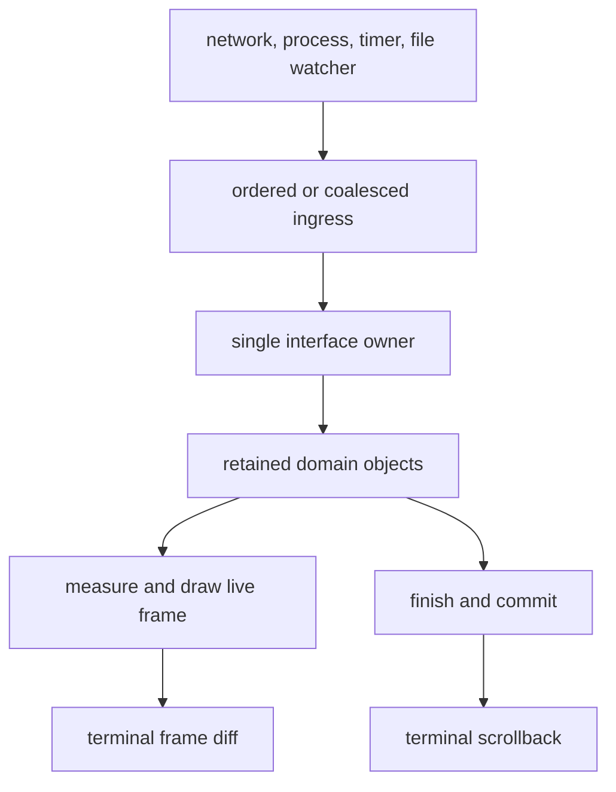
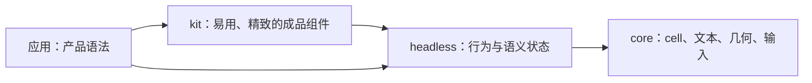
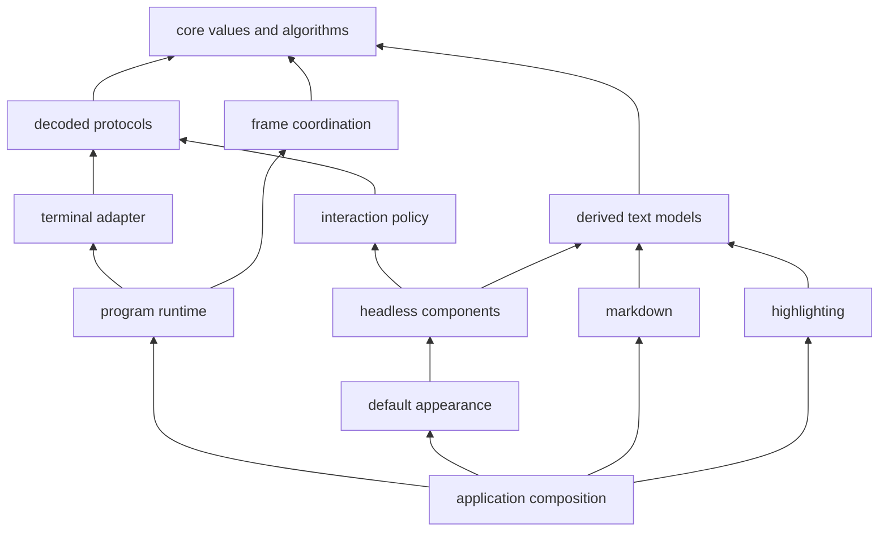

# 流式优先的架构

语言：[English](architecture.md) | 简体中文

状态：目标架构与决策框架。本文描述新工作必须保持的方向；它并不声称下文提到的每一项机制都已经存在。

[README](../README.md) 是入口，[DESIGN.md](../DESIGN.md) 讲当前系统及其来历，[ROADMAP.md](../ROADMAP.md) 记录当前功能集是怎么走到这一步的。本文的职责不同：它陈述长期架构、必须在实现变更中存活下来的边界，以及一个被提议的抽象在公开之前要通过的关卡。

**必须**、**应当**、**可以** 三个词是刻意区分的。必须是不变式。应当是默认做法，违反它需要具体理由。可以是一个选项，不是路线图上的承诺。

## 1. 决定

Oolong 是一个面向 Go 的、流式优先的终端界面底座。

**已完成的输出属于终端。** 它离开程序的活动界面，进入 scrollback（终端回滚历史），并在程序退出后依然有用。程序只保留会变的、正在进行的、或者刻意需要交互的那一部分。那个活的部分由普通的、可变的领域对象构成，由单一 goroutine 拥有，并被投影成裁剪过的 cell 帧。

因此这个架构有两个比任何 widget 树都更根本的平面：

1. **发布平面**把已完成的内容移交给终端拥有的历史。
2. **交互平面**拥有那个有界的、仍然可以变化的活动界面。

运行时和终端适配层驱动这两个平面，但不知道应用选了哪些 widget。markdown 和语法高亮这类内容变换仍然是**同级**模块，产出共享的文本值；它们不会变成运行时插件。

HTML、CSS、DOM、React、Vue、Solid、Flutter、Base UI、Radix UI、shadcn 的思想，在能澄清上述职责的地方是有用的。它们不构成在 Go 里复制一个浏览器或一个 Dart 运行时的理由。

## 2. 需求及其优先顺序

当两个都想要的性质冲突时，按这个顺序取舍。正确性在每一层都是前提，不是列表里可以谈判的一项。

1. **流式优先。** 长时间运行的输出必须保持增量，其代价由**当前正在进行的工作**决定而不是由会话的年龄决定，并且天然属于终端 scrollback。
2. **架构质量。** 随着功能集增长，可扩展性、可维护性、组合性、明确的所有权、单向依赖必须保持强壮。
3. **良好的性能。** 正常的交互工作必须明显低于终端延迟。优化必须跟在测量之后；不能因为"还没有 benchmark 变红"就接受架构层面的劣化。
4. **清晰的抽象与模块边界。** 下层知道的**更少**，而不只是知道的不同。边界的存在是因为职责或依赖不同，不是因为图上还差一个方框。
5. **符合 Go 习惯、用起来顺手的 API。** 公开表面应当更像 `bytes`、`image`、`io`、`net/http`，而不像一个 JavaScript 框架的移植。
6. **允许破坏性变更。** 项目正处在纠正公开契约最便宜的时期。更好的契约取代过时的契约；旧路径被删除。

这些需求排除了两种相反的错误。系统不能靠"让每个应用自己手工连线同一个难题"来维持简单，也不能为了应对还没有任何真实界面遇到过的问题而变得繁复。

## 3. 生命周期模型

最重要的状态机不是 mount/unmount，而是**输出的生命周期**：

```text
开放 open -> 完成 finished -> 交付 committed
```

- **开放（open）** 的内容可能继续增长或改变。它属于程序，可以被重新测量，可以被重画。
- **完成（finished）** 的内容不会再变，但仍可能被保留，因为程序需要搜索它、选择它、重排它，或者在更大的交互里保住它的位置。
- **交付（committed）** 的内容已经越过一条单向所有权边界，进入发布平面。投递成功后终端拥有它。活动程序不再重画它、不再重新折行、不再搜索它，也不再把它算作 UI 内存；传输失败按第 9 节结算，而不是把它退回组件。

这一点在 [`grid.Inline`](../core/grid/inline.go)、[`headless.Transcript`](../components/headless/transcript.go) 和 [`markdown.Stream`](../markdown/stream.go) 里已经可见。未来的抽象必须保持同样的形状，而不是把它藏进一个通用集合或者组件生命周期里。

### 3.1 两种被保留的输出

终端历史和程序内的 transcript 都是合法的，但它们买到的东西不同。

| | 终端拥有的历史 | 程序拥有的 transcript |
| --- | --- | --- |
| 生命期 | 比程序活得长 | 随程序结束，除非另行持久化 |
| 程序内存 | 发布之后即释放 | 随保留内容增长 |
| 尺寸变化 | 终端决定如何重排 | 程序可以重新测量并重画 |
| 搜索与选择 | 终端拥有 | 程序可以提供自定义行为 |
| 可寻址性 | 程序无法访问 | 稳定的程序坐标空间 |

因此**保留是一项有代价的能力，不是默认选项**。应用应当只在需要终端历史给不了的行为时才保留一个块。之后再交付它不是一种"驱逐技巧"，而是一次明确的所有权转移，以及那些程序级行为的丧失。

### 3.2 活动界面必须保持有界

活动界面通常包含一个输入器、一段开放中的回答或状态、若干浮层，也许还有一个开在刻意保留的内容之上的窗口。它**不得**隐式地包含曾经发布过的每一个块。

一种要求整个会话始终挂载的组件架构与 Oolong 不兼容，即使它渲染得很快。一种在尺寸变化时清空 scrollback 并重新吐出保留历史的算法同样不兼容：它拿用户的终端历史和无界的应用内存去换取几何上的确定性。

有界有一个可操作的含义。假设一次执行保有 `B` 个活动或刻意保留的块，其中共有 `L` 字节载荷，另有一个至多为 `T` 字节的开放尾部。在已交付输出被释放之后，组件图**必须**只保留 `O(L + T)` 的载荷和 `O(B)` 的放置状态，不受会话总共见过的块数 `N` 影响。绘制、重新测量与尺寸变化**必须**服从同一个活动边界。常量大小的累计水位是合法的；每个已交付块各留一条记录、一个闭包、一段源切片或一份放置状态则不合法。

应用**可以**为搜索、选择、回放或持久化明确购买 `O(N)` 的保留成本。做出这个选择的类型或操作**必须**把它说清楚。默认的流式组合**不得**替应用暗中做出这个选择。

## 4. 所有权与数据流

单一 goroutine 拥有界面状态。后台工作可以做 I/O 和计算，但它通过一条**窄的分发边**到达拥有者。后台工作永远不持有能够直接改动组件树或终端会话的运行时句柄。



拥有者同步地执行状态转移。一次转移可以请求一帧、发布已完成的输出、启动或停止一项外部活动，或者什么都不做。**帧请求会合并；语义转移不会因为几个转移产生同一帧就消失。**

### 4.1 状态的分类

每一个可变的值都应当清楚地属于其中一类：

- **领域状态**是一个控制器或组件的有意义的状态：编辑器文本、选择、展开的分支、校验结果、当前的流尾。只有界面拥有者改动它。
- **派生呈现状态**是可重算的：折行后的行、测量出的高度、布局矩形、匹配位置、编码后的行。它可以被缓存，但它不是第二个真相来源。
- **已提交的呈现状态**描述输入据以路由的逻辑帧：焦点、命中区域、指针捕获、子元素几何。它只在第 6.3 节所述的根绘制边界上改变。
- **已发布的输出**不再是可变的程序状态。
- **宿主事实**在会话之前或周围协商得到，通过具体的、零值安全的能力对象暴露。

如果一个字段无法归入某一类，那么这个对象多半承担了不止一个关注点，或者有一个隐式的生命周期还没有被命名。

### 4.2 保留式 Go 系统中的 `UI = f(data)`

Oolong 采纳函数式投影，但不要求不可变的应用模型：

```text
event              -> model.Apply(action)
model snapshot      -> measure/layout
model + layout      -> frame
finished live value -> publication
```

领域模型可以是一个充血的可变对象。它的方法维护不变式，并由唯一的拥有者调用。测量和绘制在**可观察意义上是纯的**：给定同样的有意义状态、视口、主题和环境，它们产出同样的结果。

它们**可以**更新私有的备忘缓存或上一帧的几何缓存。它们**不得**：

- 启动 I/O 或 goroutine；
- 推进语义状态；
- 依赖于被恰好调用一次；
- 让自身含义依赖于兄弟节点的绘制顺序；
- 发布输出；
- 调用会改动无关状态的应用回调。

这是 React 纯度规则中有用的那一半，翻译到保留式对象模型里。对刚构建出来的一帧做局部改动、以及不可见的缓存改动，是允许的；**渲染期间可观察的状态转移不允许**。

### 4.3 副作用

副作用只发生在明确的边界上：

- 事件处理器改动拥有者持有的状态；
- 后台工作做外部 I/O 并把结果 post 回来；
- 运行时能力对象与终端或宿主交互；
- 发布转移已完成的输出；
- 定时器把合并过的回调入队，并且有明确的停止路径。

**不存在通用的 effect 系统。** `context.Context` 跨调用边界携带取消和截止时间；它不会变成服务定位器或状态口袋。

## 5. 从前端与 Flutter 体系里拿什么

先前技艺的价值在于**职责的划分**。实现机制是语言和平台特有的。

| 来源思想 | 采纳 | 不引入 |
| --- | --- | --- |
| HTML | 带类型的语义角色，有意义的组合 | 标记解析器，或字符串属性口袋 |
| DOM | 稳定身份、父子路径、生命周期、以及真的需要树的地方的事件路由 | 公开可变的 DOM、选择器、全局监听器、任意树改动 |
| CSS | 把指定值和计算值分开；只在有意义的地方继承；状态驱动的外观 | 文本 CSS、选择器优先级、类名组合，或者把样式引擎放进 `core` |
| React | 单向数据流、纯投影、最小状态、声明式列表的显式身份 | hooks、处处不可变、渲染期副作用、强制的全树协调 |
| Vue | 声明式视图**可以**同步到保留式对象上 | 基于 proxy 的追踪、模板编译器、隐式依赖收集 |
| Solid | 让最小的有意义单元失效，不重算无关的工作 | 在测量证明有必要之前就上通用 signal 图 |
| Flutter | 区分配置、保留式身份、布局/绘制、平台嵌入；在存在约束式布局的地方，约束向下流、尺寸向上流 | 复制它的类层次、要求三棵公开的树、默认每帧重建一次性描述 |
| Base UI / Radix UI | 无外观的行为、可访问的交互、复合部件、明确的受控/非受控所有权 | 把 React Context 当成 API 形状，或者布尔参数泛滥 |
| shadcn | 在 headless 原语之上提供更易用、更精致的组件层：连贯的默认值、方便的组合与可主题化的成品外观 | 把源码复制当成架构要求、生成式所有权，或把产品语法放进共享库 |

这些区分背后的参考：[DOM Standard](https://dom.spec.whatwg.org/)、[CSS Display](https://www.w3.org/TR/css-display-4/)、[React 的渲染纯度](https://react.dev/learn/keeping-components-pure)、[Vue 的渲染模型](https://vuejs.org/guide/extras/rendering-mechanism)、[Solid 的细粒度响应式](https://docs.solidjs.com/advanced-concepts/fine-grained-reactivity)、[Flutter 架构概览](https://docs.flutter.dev/resources/architectural-overview)、[Radix Primitives](https://www.radix-ui.com/primitives/docs/overview/introduction)、[Base UI](https://base-ui.com/react/overview/about)、[shadcn/ui](https://ui.shadcn.com/docs)。

### 5.1 先分职责，再谈对象图

Flutter 的 Widget、Element、RenderObject 是三种不同职责的好名字：

1. 界面应该包含什么。
2. 哪个活的实例拥有身份和生命周期。
3. 它如何被测量、命中测试和绘制。

Oolong 必须让这三种职责可区分。但由此**并不能推出**仓库需要三个导出接口、三个包或者三张对象图。保留式的 Go widget 本身已经提供了稳定身份并拥有行为。只有当一个声明式描述层真正产生了"把一次性描述与持久实例协调起来"的需求时，一棵独立的 Element 树才成立。

在那之前，加一棵就是投机性的间接层。

### 5.2 声明式组合是可选项，不是地基

未来的高层 API **可以**允许一个纯函数描述一棵活的子树，并用稳定的 key 去协调它。这样的 API 属于保留式组件**之上**，并且必须下沉到同一条测量、事件和帧的路径上。它**不得**成为 `grid`、`layout`、`term`、`present` 或 `program` 的依赖。

只有当至少两个真实界面证明"手工同步条件渲染或重排的组件树"是反复出现的错误来源之后，它才配拥有公开 API。采纳之前，分配成本、身份规则、焦点保持和流的生命周期必须被 benchmark 并写成规格。

### 5.3 组件阶梯

组件系统分为四层，依赖保持单向：



`headless` 是类似 Base UI/Radix 的一层。它拥有控制器、复合部件、受控与非受控状态、键盘与指针策略、焦点规则和带类型的语义。它不选择应用的颜色、字形、间距或产品语言。

`kit` 是 Oolong 所需要的 shadcn 式一层：它让 headless 部件开箱即用、外观良好。它**可以**组合多个 headless 部件，给出有主见的良好默认值，应用一套连贯主题，并让常见调用点更短。它仍然是正常 import、正常版本化的 Go 库代码；源码复制和生成器不属于本架构。默认组合不够用时，调用方仍然**必须**能够取得底层控制器和语义部件。

应用代码拥有批准流程、模型回答、命令面板内容、部署状态这类产品语法。共享组件**可以**提供表达这些语法所需的对话框、列表、编辑器、表格和状态原语，但**不得**命名或编码产品决策本身。

## 6. 组合模型

组合主要是**对象组合**加**小的能力方法集**。

当前这几个窄角色是成立的：

- 可绘制者往一个已定位、已裁剪的 view 里写；
- 测量者在相关约束下报出它需要的尺寸；
- 可交互的值**可以**消费一个事件；
- 可聚焦的值在键盘归属改变时被明确告知；
- doer 暴露具名动作，与按键绑定无关。

**不得**仅仅因为若干 widget 都能实现某个行为，就把它加进一个通用基接口。需要某个可选能力的消费方，在本地声明那个小接口。具体类型仍然是调用方构造和收到的正常值。

### 6.1 充血控制器与复合部件

复杂的无外观组件应当有一个具体的控制器，拥有它的状态机并暴露有意义的操作。视觉的或结构的部件围绕那个控制器组合。

例如一个对话框，概念上有 root、trigger、content、title、description、actions 和 close 操作。在 Go 里这些不需要 React 命名空间或 Context。它们可以是从 `*Dialog` 控制器创建出来的具体值或函数，在真的需要替换的地方用本地声明的小接口。

这个结构应当取代那种靠不相关的布尔字段生长的配置。**互斥的变体应当是独立的构造器、具体类型或显式值。布尔适合表达独立的状态，不适合在几种组件形态之间做选择。**

### 6.2 受控与非受控

可复用的无外观组件需要两种合法的所有权模式：

- **非受控：** 组件拥有本地状态，并提供最简单可用的零值或构造器产物。
- **受控：** 调用方提供存储或绑定，因为若干组件要围绕同一个值协作。

这个区分必须体现在构造方式或被绑定的值上，而不是藏在 `Controlled bool` 后面。当组件确实在编辑调用方拥有的数据时，现有的带类型访问器是有用的模式。组件**不得**保留一份可能与其拥有者漂移的受控状态私有副本。

### 6.3 布局与已提交的几何

`core/layout` 保持为纯几何。它划分尺寸并返回矩形；它不认识 widget、焦点、主题或事件路由。

容器**可以**把布局和路由合在一起，因为这两项职责共享同一份已提交的几何。要守住的边界是"有意义的组件状态"和"派生几何"之间的边界，而不是两个总是一起变的函数之间的边界。

**输入必须针对最后一个完成的逻辑帧的几何来路由。** 这里的“完成”是指：用来构造该帧的根 `Draw` 已经返回，并且该帧已移交给呈现管线；它并不表示终端传输已经确认了每一个字节。

绘制就是几何事务。组件树绘制期间，所有与路由相关的布局都写入一份待定快照。只有完整的根绘制返回之后，组件组合根才把整份待定快照交换为已提交状态。`Handle` 只读取已提交的快照。交换前到达的事件看到上一帧，交换后到达的事件看到新一帧。任何子节点都**不得**提前发布自己的新命中区域。

这个事务属于依赖图的组件一侧。运行时只调用 `Draw` 和 `Handle`；它不会回调 `headless` 去宣布一帧已被接受，`headless` 也不会 import `program`、`present` 或终端包。切片 2 **必须**证明：在不建立第二棵树、不制造反向依赖的前提下，为嵌套几何提供暂存和整体交换所需的最小组件侧绘制作用域是什么。

指针捕获属于发起它的那次交互，直到释放或目标消失为止。

如果包裹式组合、双向定尺寸或多种布局策略无法通过现有的测量者契约干净地表达，**可以**引入一个带最小/最大宽高的通用约束对象。它必须由一个完整的组件来证明，而不是因为 Flutter 有一个就加上。

### 6.4 样式与语义

无外观的行为暴露语义状态，如 focused、selected、disabled、invalid、open。它不选颜色或字形。外观层把语义角色、部件和状态映射到终端呈现。

如果固定的主题字段不再够用，下一步是一个**带类型的规则解析器**，不是 CSS 语法。它的优先级应当保持短且可解释：

```text
库默认值 < 应用主题 < 子树作用域 < 实例覆盖
```

只有天然可继承的属性（比如默认文本样式）才应当继承。布局值、可聚焦性和行为不会仅仅因为 CSS 能表达其中一些就变成样式。

即使没有浏览器的可访问性树，语义仍然有用。一个带类型的语义投影可以驱动口述形式、结构化测试、检查工具、自动化，以及未来的宿主集成。装饰性的渲染对象可以从那个投影中消失；一个语义控件也可能由多个盒子渲染。这是又一个不该把组件身份等同于 cell 几何的理由。

## 7. 模块、包与依赖方向

现有的模块规则仍是默认：**只有当存在真正不同的依赖集，或者需要独立版本化的扩展时，才建立模块。** 不要为了让架构图对称而拆模块。

语义依赖图：



`program` 与 widget 阶梯保持正交。它驱动一个由消费方定义的组件方法集，并且不得 import `components`。反过来，组件也不知道是哪个终端宿主、调度器或运行时在驱动它们。

### 7.1 一个包必须配得上它的名字

一个新包应当同时满足以下几条：

1. 它的职责能不能用一句话说清，而不用 `common`、`util`、`service`、`manager` 之类的位置词？
2. 它是否拥有一组连贯的具体行为，而不是一个接口加一堆转发适配器？
3. 是否至少有两个真实消费方需要这条边界？
4. 这条边界是否**从下层拿走了知识**，或者隔离了依赖？
5. import 是否能继续单向，而没有一个回调注册表或服务定位器藏着反向边？

如果不能，代码就留在拥有它的那个领域里。

一个共享的活动树底座**可以**最终在 `components` 模块里挣到一个包，前提是内建的无外观组件和独立的第三方组件都需要它。只要依赖集和发布周期不变，它就挣不到一个新模块。**包的建立跟在被证明的边界之后，而不是走在它前面。**

### 7.2 下层保持通用

下层包可以知道字节、cell、字素宽度、矩形、解码后的输入和帧时序。它们**不得**知道对话框、被选中的行、校验、命令面板、主题或模型的回答。

一个下层抽象之所以通用，是因为**它的契约在它自己的词汇里是完整的**，而不是因为它接受 `any`、属性 map，或者为它决定不了的每件事都开一个回调。一个只是把上层知识搬进字符串的通用逃生口，是抽象泄漏。

架构测试继续强制 import、文档引用、模块依赖承诺、图的完整性和无环性。新增一个 ring 就是加一个节点及其直接的下层依赖。

## 8. 流式摄入与背压

流式优先的输出**在界面拥有者之前就开始了**。网络读取器、子进程管道和文件监视器常常从后台 goroutine 产出。把每个 chunk 都当成一个不相关的分发闭包是正确的，但会产生过多的队列对象和无界的滞后。

摄入有三种语义类别：

| 类别 | 例子 | 必须的策略 |
| --- | --- | --- |
| 无损有序数据 | 文本 chunk、进程输出、协议记录 | 保序、把相邻数据批量化、施加背压而不是丢弃 |
| 可替换状态 | 进度百分比、最新尺寸、最新查询结果 | 保留最新值，合并掉过时的工作 |
| 离散转移 | 完成、错误、批准、命令结果 | 按序保留每一个有意义的转移 |

**帧请求是可替换信号。文本 chunk 不是。** 把两者同等对待，不是浪费工作就是丢数据。

`Dispatcher.Post` 仍然是那条通用的、非阻塞的所有权边。它**不得**被悄悄改成一个有界队列，从而让拥有者阻塞在只有它自己能消费的工作后面。更高层的流摄入**可以**批量化或限界生产者数据，但它必须规定：

- 写入是否可能阻塞，以及取消如何终止它；
- 哪些值可以被合并；
- 顺序如何保持；
- 消费者退出时会发生什么；
- 由哪个 goroutine 调用消费者；
- 关闭之前是否投递错误或最后一个不完整的 chunk。

[`program.ByteIngress`](../core/program/ingress.go) 是由子进程示例证明出来的、刻意保持狭窄的结果。它接收无损字节；达到明确的待处理字节上限时阻塞生产者；把相邻写入批量化，并且在 owner 队列里至多保留一个任务；在已接受数据之后投递完成或失败；随 dispatcher 一起停止。它不建立第二个 owner loop，也不改变 `Dispatcher.Post` 的非阻塞契约。

这份证据并不能证明通用 mailbox、observable、带类型的 stream，或者另外两类语义的政策是合理的。那些抽象仍然需要各自完整的真实调用方来证明。

### 8.1 增量变换

流式变换必须避免"每个 chunk 都做与迄今全部内容成正比的工作"。它应当把**稳定前缀**和**短的开放尾部**分开：

```text
新 chunk -> 扫描新材料 -> 发布新变稳定的前缀 -> 重渲开放尾部
```

`markdown.Stream` 是参考形状。解码器可以保留未完成的协议语法和样式状态；渲染器可以保留开放中的块；两者都不为了方便而保留已发布的源。

### 8.2 发布保证

发布是有序且无损的：

- 一个不完整的行可以跨 chunk 保持开放；
- 整行发布会先关掉之前开放的那一行；
- 空 chunk 什么都不发布；
- 写失败不会静默丢弃待发内容；
- 关闭时，最后的尾部是发布还是刻意放弃，取决于调用方的明确动作；
- `Run` 在已接受的终端输出被排空之前不返回，否则以错误报告未能排空。

终端**可以**在尺寸变化时重排它自己的历史。Oolong 不会为了模拟终端没有提供的控制权而保留并重放全部历史。

## 9. 失败与降级模型

发布路径有序、对外可见，而且部分不可逆。因此它的失败契约是架构的一部分，不是实现细节。系统**必须**区分：可选能力缺席、界面能够表达的来源级失败，以及已经无法维持输出所有权的会话损坏。

### 9.1 失败域

| 失败域 | 必须的行为 |
| --- | --- |
| 可选宿主探测 | 能力缺席、探测无响应或非关键事实过期时，降级到有文档的保守值；这不是一次操作失败。 |
| 来源或变换 | 完成和失败作为有序的语义转移进入拥有者。应用**可以**呈现该失败，也**可以**继续交付更早的稳定输出。 |
| 输入传输 | 干净结束时正常关闭会话。明确知道自己失败的传输**必须**保留并暴露 cause；`Run` **不得**把一个已知且非取消导致的失败变成成功。 |
| 帧构建 | 绘制只改动内存中的待定帧和待定几何。库代码不吞掉应用代码的 panic，也不假装一个不完整的逻辑帧已经提交。 |
| 输出传输 | 第一次终端写失败对该会话是致命的。后续帧不再尝试，`Run` 返回保留写入 cause 的错误。 |
| 收尾 | 取消会停止生产者；已接受的帧得到文档规定的排空宽限；即使已有其他失败也要尝试恢复终端；彼此独立的错误用 join 合并。 |

核心层不发明日志、重试、重连或持久化政策。它们属于宿主或应用，因为只有那里知道新传输是否仍是同一个会话，以及回放是否安全。

### 9.2 发布结果

帧队列取得不可变字节的所有权，叫作**接受**；输出传输成功消费整个帧，叫作**投递**。交付一个活动块，会把它转移到发布平面，于是组件载荷**可以**被释放；此后由发布平面拥有足够的不可变数据，负责完成投递或报告失败。

终端或 SSH 传输可能在写出一个未知长度的前缀后失败。这个结果有歧义：Oolong 无从知道用户究竟看到了哪些 cell。它**不得**静默重试该帧，不得把已交付历史自动重放进新会话，也不得声称 exactly-once 投递。它会停止发布、结算已排队工作、返回带 cause 的错误，并在传输允许的范围内恢复终端。调用方**可以**启动一个新会话并重建活动状态，但那是一次新的所有权决定。

正常取消本身不是失败。它仍然会在有界且有文档的宽限期内等待已接受输出。排空超时、所有权移交被拒绝或 writer 错误，即使发生在一次原本正常的关闭里也属于失败；返回成功会错误地声称显示所有权已经结算。

### 9.3 降级规则

降级**可以**降低保真度，绝不能降低正确性：

- 未知的 ground、色深、cell 像素尺寸或可选协议使用有文档的安全默认值，或者报告不支持；
- 图片、剪贴板、通知或 shell 集成能力缺席时，这个事实对有权选择文本回退或空操作的那一层保持可见；
- 无效或过期的尺寸被规范成安全的空/最小几何，或者报告错误；它们不会造成 panic 或由输入大小决定的分配；
- 外观**可以**替换字形、颜色或边框，而 headless 行为和带类型的语义保持不变；
- 无损数据绝不会仅仅为了让界面保持响应，就被重新归类成可替换状态。

回退**必须**局部且明确。下层包报告自己知道的事实；它不猜产品层的替代方案。

## 10. 可执行的架构

凡是代码能够违反的不变式，都需要一个可执行的守卫。散文解释理由和边界；测试、静态检查或发布检查让越界明确失败。一个纵向切片只有为它使得可执行的每一条不变式补上守卫，才算完成。

| 不变式 | 可执行证据 | 关卡 |
| --- | --- | --- |
| 依赖方向与词汇 | `internal/arch` 从声明的 DAG 推导禁止 import，并检查模块承诺、文档引用、图的完整性与环 | 每次 CI |
| 第 3.2 节的活动生命期有界 | 一条确定性的组件测试证明 commit 会移除强载荷引用和逐块放置记录；另一条独立进程压力测试让大型流取 `N` 与 `2N`，GC 后拒绝与 `N` 成正比的活堆增长 | 切片 1 以及每种 transcript 实现的必需关卡 |
| 增量无损摄入 | 爆发、取消、关闭、残缺尾部以及生产快于消费的测试，证明顺序、批量、声明的边界与不丢数据 | 切片 1 的必需关卡 |
| 测量与绘制在可观察意义上纯 | 每个有状态组件从同一份有意义状态绘制两次；除了被明确检查的私有缓存之外，语义状态不变且产生的帧一致 | 组件测试套件 |
| 第 6.3 节的单帧路由几何 | 一条路由测试在新根绘制暂存时观察到旧快照，根提交之后观察到完整的新快照；任何子节点几何的混合都不可见 | 切片 2 的必需关卡 |
| 空闲工作为零 | [`TestAnIdleProgramStopsWriting`](../core/program/program_test.go) 与定时器测试证明不存在无条件帧时钟和重复字节 | 每次 CI |
| 失败与所有权结算 | 故障宿主注入短写、部分写、断连、排空超时、不支持的能力和收尾错误；断言覆盖返回的 cause、不再后续写入、有界关闭与尽力恢复 | 切片 1 以及每个新宿主的必需关卡 |
| 公开模块兼容性 | 每个模块脱离 `go.work` 构建；发布 CI 把每个公开 API 与其 v1 基线比较，并在所有受支持的源码集合上检查声明的 Go 地板 | v1 前后都必需 |

有界内存关卡刻意分成两部分。内部引用和记录数量是确定性的，是主要证明。黑盒堆测试在独立进程里运行，并使用足以压过运行时噪声的载荷；它验证架构后果，但不把某个绝对分配次数变成契约。Benchmark 和长时间 soak 测试提供趋势证据，不能取代确定性的守卫。

并非每条语义规则都能由全仓库静态测试推导出来。如果执行方式必然是一种测试模式，引入组件或宿主的切片就**必须**实例化那个模式。评审者应当拒绝一条既无法观察失败、又没有点名计划如何执行的新增“必须”。

## 11. 性能模型

性能是一项设计约束，不是组织原则。

期望的复杂度是：

- 内存正比于活动界面加上应用显式保留的内容，而不是正比于已经交付的内容；
- 摊还工作量正比于每个到来的 chunk 加上那段短的开放尾部；
- 绘制正比于活动视口和可见组件，而不是会话年龄；
- 尺寸变化的代价正比于活动的保留内容，绝不正比于终端拥有的历史；
- 空闲界面处于停泊状态，不写字节，也不跑无条件的帧时钟；
- 每个定时器至多有一次待处理的 tick；
- 输入没变时不重复测量或折行。

不承诺每一帧零分配，也不承诺每次更新只碰一个 cell。相对于普通 Go 代码，终端是慢的，清晰值得一点常数开销。不过下面这些即便在做 profile 之前也已经是架构气味：

- 随 transcript 长度呈二次增长；
- 全历史重画或全历史保留；
- 每个被动组件一个 goroutine 或一个 ticker；
- 帧路径上的反射或字符串键动态分发；
- 没有证据就在每个 token 上重建一次性对象树；
- 在不可信数据上做无界或输入相关递归的布局算法。

### 11.1 先测量，后优化

Benchmark 应当回答产品问题：

- 一小时的流在完成块交付之后，对内存的影响是什么？
- 生产者的爆发比帧能展示的速度更快时会发生什么？
- 更新一个开放中的 markdown 块的代价是多少？
- 一个没有变化的帧做了多少工作、写了多少字节？
- 对一个大的、刻意保留的 transcript 做尺寸变化，代价是多少？
- 宽字素、组合符、链接和图片是否保持了它们的不变式？

用 benchmark、分配报告、trace 和 profile 来选择优化。在证据指出热点之前保持直白的实现。**让公开契约变复杂的优化，需要比藏在实现内部的优化更强的证据。**

## 12. Go API 规则

公开 API 遵循以下规则：

1. **具体的领域对象是入口。** `Runtime`、`InlineRuntime`、`Transcript`、`Editor` 这类值拥有连贯的行为。
2. **接口由消费方声明。** 它们只包含该操作所需的最小方法集。
3. **接受接口，返回具体值。** 调用方不应当为了发现标准能力而做类型断言。
4. **优先让零值可用。** 零值要么是惰性的，要么是就绪的；它不是半初始化的。当不变式、资源或必需数据要求时，才有构造器。
5. **缺席与失败是两回事。** 一个不被支持的可选能力可以有文档化的空操作或 false 结果；一个尝试执行但无法维持其契约的操作返回 error。
6. **变体是显式的。** 全屏运行时和 inline 运行时是不同的具体类型，因为只有其中一个能发布到 scrollback。避免让一半 API 失去意义的模式布尔。
7. **状态转移是方法。** 充血对象自己维护不变式，而不是暴露一堆需要调用方按顺序协调更新的字段。
8. **配置与复杂度成比例。** 简单的声明式值用普通字段。函数式选项留给真正复杂的初始化，不作为每个构造器的仪式。
9. **名字依赖包上下文。** 用 `grid.View`、`layout.Flow`、`program.Run`，而不是重复包名的名字。
10. **回调只有一个目的。** 如果一个回调开始累积生命周期规则、错误、取消和可选行为，就把它换成一个具名的领域对象。
11. **错误补充操作性上下文并保留 cause。** 库代码里不要既记日志又返回同一个错误。
12. **没有全局可变的服务状态。** 主题、宿主服务、时钟和资源都是显式的值。
13. **泛型消除重复的算法。** 它们不用来造组件类型层次或通用状态容器。
14. **只有一条明显的路。** 新契约取代旧契约时，更新调用方并删掉过时的路线。

API 的手感在**示例的调用点**上评估，不只在声明处评估。最短的可用流式程序和最苛刻的组合，都应当线性可读，没有隐藏的全局初始化。

## 13. 破坏性变更与发布政策

Pre-1.0 正是纠正所有权和抽象边界的时候。

一次破坏性的架构变更必须在整个仓库内是**原子的**：

- 引入最终契约；
- 在同一次变更里更新所有模块、示例、测试和文档；
- 删除过时的类型、字段、构造器和代码路径；
- 删除只证明过时行为的测试；
- 不添加废弃别名、兼容适配器、特性开关、迁移模式或回退分发；
- 记录新契约及其理由。

已发布的模块顺序可能要求标签从下层依赖向上层依次发布。Oolong 的所有公开模块作为一条协调一致的发布列车发布，使用相同版本和同一份发布说明。Pre-1.0 期间，只要一次发布改变了跨模块契约，使用者就**必须**把这组模块一起升级。第一个 tag 建立之前，源码树和模块独立检查都**必须**为绿；任何模块都不得依赖一个只在 workspace 中存在、尚未发布的形状。这个发布层面的问题**不构成在源码树里同时保留两套运行时契约的理由**。

破坏性变更是改进契约的许可，不是折腾契约的许可。一个提案在旧路径被删除之前，仍然需要一个持久的所有权模型、真实的调用点和端到端的实施方案。

### 13.1 v1 兼容性边界

版本 1 会改变这项政策。此后每个公开模块都独立承诺 Go 1 兼容性：不删除导出名字，不改变签名，不给导出的 provider 接口增加方法，文档化的零值、错误、所有权和并发行为继续有效；不兼容的重设计需要新的 major module path。协调发布列车仍**可以**一起发布所有模块，使用者通常也**应当**整组升级，但正确的 `go.mod` 最低版本**必须**让任何满足声明依赖图的 v1 minor 混合都能工作。

只有以下条件全部成立，pre-1.0 才结束：

1. 第 15 节的切片 1 至 3 已完成；切片 4 和 5 要么没有必要，要么已经证明可以兼容地增量添加。
2. 第 14 节的已知不变式违规清单为空，并且有界生命期、呈现快照、空闲、失败、race、架构和受支持平台关卡都在 CI 中运行。
3. 规范流式组合和至少两个独立维护的、非示例应用已经基于同一个 release candidate 发布，并且在其稳定期内不需要不兼容的契约变更。
4. 每个公开模块的每一个导出标识符，都完成了所有权、零值、错误、并发和依赖方向评审。公开 API 基线已经记录，发布 CI 会与之比较。
5. 每个模块都能在自己声明的 Go 地板上以 `GOWORK=off` 构建并测试；发布顺序已经按依赖叶子向上演练；整组升级关系已有文档。

这些条件是破坏性变更时期的出口，不是留给某个 v1.x 的愿望。能够兼容添加的能力**可以**不进入 v1；尚未稳定的所有权或生命期契约不可以。

## 14. 当前的符合性与能力缺口

现有基础的大部分已经指向这个方向：inline 发布、有界的 transcript 释放、带因果结果的输入流、有界的字节摄入、单拥有者运行时、增量 markdown、裁剪过的 cell view、消费方定义的能力、以及被强制执行的依赖 DAG，都是要保住的资产。

### 14.1 已知的不变式违规

下列问题与本文的一条“必须”相抵触，并且在 v1 前**必须**清空：

- **几何在绘制过程中变得可观察。** 容器、栈、字段和带外观的组件在绘制时记录命中测试几何。数据本身是正确派生的，但还没有一个明确的提交点，把路由快照绑定到被接受用于呈现的那一帧上。持久的修法应当确立那条边界，而不是在现有缓存旁边再加一个缓存。

### 14.2 缺失的能力与证明

下列问题不是当前的不变式违规，而是系统仍然缺少的能力或端到端证明：

- **失败行为分散在各处实现，但还没有被证明为一份完整契约。** Writer 失败、排空、取消、终端恢复、宿主 EOF 和能力缺席在各自区域已有测试。第 9 节的失败矩阵仍需要一个统一的故障注入纵向切片，其中包括有歧义的部分写。
- **复杂控件暴露了行为和外观，但几乎没有共享语义。** 当前的 headless/kit 划分是成立的。复合部件、明确的受控所有权和结构化的语义投影，还没有跨多个控件确立起来。

这些不是若干次独立造框架式重构的邀请函。下面的每一项都有一个具名切片负责，好让修复带着它真实的调用方、测试和最终所有权模型一起落地。

## 15. 架构如何生长

工作按**纵向切片**推进。每个切片都留下一个可用的、经过测试的产品，并增加一项最终方向上的能力。任何阶段都不为后一个阶段去造一个没人用的框架。

| 切片 | 关闭或证明的问题 | 完成证据 | v1 状态 |
| --- | --- | --- | --- |
| 1 | 已交付载荷保留、输入失败、有界流摄入、端到端失败语义 | 规范流、保留关卡、故障宿主、PTY | 必需 |
| 2 | 原子提交几何与呈现状态所有权 | 跨嵌套组件的旧/待定/新路由快照测试 | 必需 |
| 3 | 复合 headless 所有权、共享语义与精致的 `kit` 组合 | 同一个模式由两个控件证明 | 必需 |
| 4 | 只在固定主题不再够用时引入带类型的计算式外观 | 两个不相关控件和一次应用覆盖 | 可选且可增量添加 |
| 5 | 只在真实同步 bug 证明需要时引入声明式撰写 | 两个真实应用、身份与生命期规格、benchmark | 可选且可增量添加 |

### 切片 1：有界流式发布与失败语义

构建或扩展一个成品界面，把这些组合到一起：

- 后台增量输入；
- 一段开放中的 markdown 或样式文本尾部；
- 把稳定块发布到 scrollback；
- 一个刻意需要交互的保留 transcript；
- 一个输入器；
- 焦点与指针路由；
- 一个浮层，例如批准对话框；
- 尺寸变化与取消；
- 一个真实的 PTY 测试；
- 一个故障注入宿主，覆盖来源失败、输入关闭、终端部分写、排空超时、能力缺席和收尾。

**这是架构探针。任何新抽象都必须让这个界面更简单，而不教会下层包什么是聊天、模型、批准或命令。**

`Host.Input` 已经会返回一条带因果结果的 `EventSource`：通道关闭之后可以读取 `Err` 结果，因此干净 EOF 与已知传输失败保持可区分，同时 `program` 不耦合到任何具体宿主。`ByteIngress` 现在提供无损字节政策：它的子进程调用方证明了批量化、待处理字节上限、生产者背压、完成与失败的顺序，以及不改变通用 dispatcher 的 owner 取消。`Transcript.Commit` 已经会真正释放已交付载荷与逐块放置记录，同时保留一个聚合的活动坐标基准；它的确定性保留测试以及独立进程 `N` 对 `2N` 的 GC 测试，是这个切片其余工作**必须**保持为绿的关卡。这个切片剩下的是上述组合界面和故障注入失败证明。一个只是画出了正确最终屏幕、却仍然保留整个会话的演示不算完成。

### 切片 2：消除呈现状态的泄漏

找出被两个或更多组件重复实现的几何、焦点或命中测试状态。只把被证明共同的那份职责移交给它持久的拥有者。呈现快照必须与帧一致地提交，领域对象不得依赖于一份构建到一半的布局。

组件组合根在 `Draw` 期间暂存待定的路由快照，并在根绘制完成后交换它。运行时不接收任何组件专用回调。第 10 节的新旧快照测试是完成条件。如果还没有挣到独立的包边界，这个切片**可以**留在 `headless` 内部。

### 切片 3：复合无外观控件

用一个复杂控件（对话框、选择器或表单）来确立：

- 控制器所有权；
- 复合部件；
- 受控与非受控构造；
- 语义状态；
- 焦点恢复；
- 外观注入而行为不依赖 `kit`。

然后把这个模式应用到第二个控件上。**只有共同的结果才被泛化。**
对于每个控件，`kit` 还**必须**在 headless 部件之上提供一个精致、可主题化、调用点简短的组合。shadcn 的经验在这里得到验证：更好的默认值和人体工学，而不是源码复制，也不是产品专用行为。

### 切片 4：计算式外观与语义

如果固定主题值加回调导致了重复的状态映射，就引入上文说的那个小型带类型解析器。用至少两个不相关的控件和一次应用级覆盖来证明它。同时加上语义检查以及口述或结构化测试，好让角色成为行为而不是装饰性的名字。

### 切片 5：声明式撰写，如果挣到了的话

只有在真实应用暴露出反复出现的同步 bug 之后，才考虑一个纯描述加协调的层。它必须保住保留式控制器、焦点、流式发布和直接的底层绘制。它保持可选，并且位于核心运行时之上。

### 每个切片的准入关卡

一个切片只有在满足下列全部条件时才算完成：

- 示例端到端跑通；
- 单元、race、架构和相关的 PTY 测试通过；
- 旧路径已删除；
- 空闲行为和流行为仍然正确；
- 新依赖有理由且已声明；
- 文档说明了这个抽象为什么存在、到哪儿为止；
- 每一条新近可以执行的“必须”都有具名的可执行守卫；
- 不需要后续任何切片才能让当前产品可用。

## 16. 明确否决的设计

以下不是中间里程碑：

- 保留并重画全部已发布的历史；
- 在 `core` 里强制的虚拟 DOM 或全树协调器；
- 公开可变的 DOM 与选择器 API；
- CSS 解析器或不受限的选择器引擎；
- 通用的 hooks、signals、observables 或 effects 框架；
- 每个事件都复制一份不可变 widget；
- 一个包含绘制、测量、布局、焦点、生命周期、语义和一切可选行为的接口；
- 携带运行时、主题、状态和宿主能力的通用 Context 或服务定位器；
- 只按架构位置命名的包；
- 依赖集和发布周期相同却每个概念层一个模块；
- widget 里的隐藏 goroutine，或没有明确停止条件的定时器；
- 围绕过时 pre-1.0 API 的兼容层；
- 把源码复制生成器或 vendored recipes 当成主要组件分发模型；
- 共享组件里的产品语法；
- 基础包里的外观决策。

否决这些机制并不等于否决它们试图解决的问题。它要求的是一个尊重 Go、尊重终端、尊重流生命周期的解法。

## 17. 评审清单

每个架构提案都用这份清单过一遍。

### 流式

- 已完成的内容是否离开了活动内存和绘制工作？
- 一个开放中的部分行或部分块，是否不必等它完成就能表示？
- 顺序、批量、背压、取消和收尾是否都明确？
- 尺寸变化是否避免了保留或重放终端拥有的历史？

### 架构与组合

- 每一份可变状态由谁拥有？
- 领域状态、派生缓存、已提交几何和已发布输出是否彼此区分？
- 这个抽象是否在至少两个地方减少了重复的端到端工作？
- 行为能否在不 import 那一套默认外观的情况下被组合？
- 每条依赖是否都指向更通用的词汇？

### 性能

- 工作量是否由活动界面而不是会话年龄决定？
- 流是否被增量处理，而不是每个 chunk 都从头来一遍？
- 什么都没变时界面是否空闲？
- 增加的复杂度是否有 benchmark 或 profile 支撑？

### 失败与降级

- 哪些失败是可恢复的领域转移，哪些会终止会话？
- 所有权转移之后，在投递结算之前由谁保有字节？
- 部分写是否会让投递产生歧义，并且避免了自动重放？
- 取消、排空超时、收尾和彼此独立的错误是否都可观察？
- 回退是否只降低保真度，而不削弱顺序、无损性或语义？

### 模块与包

- 新模块是否隔离了一条真实的依赖或发布边界？
- 新包能否陈述一项连贯的领域职责？
- 架构 DAG 是否已更新且仍然无环？
- 是否有下层包通过代码、注释、字符串、回调或配置获得了上层术语？

### Go API

- 常见调用点是否简短、线性、显式？
- 零值是否可用或安全惰性？
- 接口是否小、由消费方拥有、并被替换实现证明过？
- 返回的是否是具体类型？
- 变体是否被编码进类型或值，而不是互相矛盾的布尔？
- 是否只有一条路，而不是遗留路径加新路径并存？

### 交付

- 这次变更结束时仓库是否可用？
- 示例、测试和文档是否一起更新了？
- 过时代码和兼容脚手架是否已删除？
- 这次变更让哪一条不变式变得可以执行？它的可执行守卫在哪里？
- 受影响模块能否独立构建，协调发布顺序是否有效？
- 这次变更能否满足 v1 兼容性承诺，还是在有意使用文档规定的 pre-1.0 窗口？
- 这个决定是否持久，还是被描述成"以后再换"？
