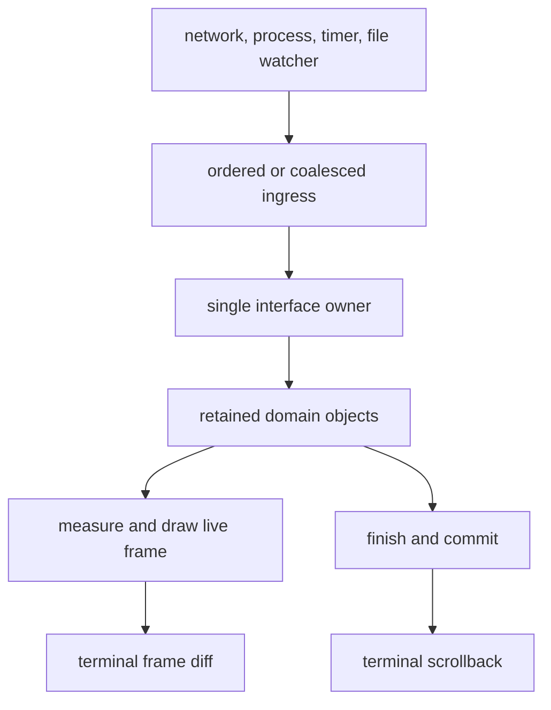
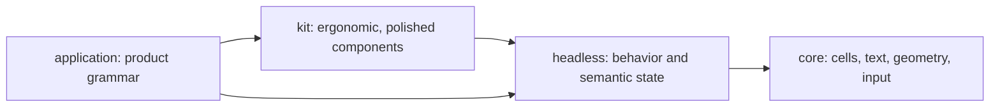
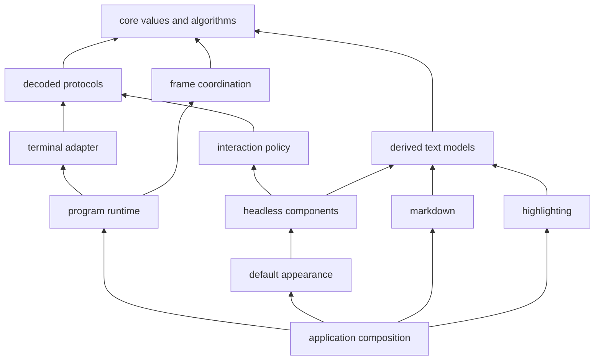

# 流式优先的架构

语言：[English](architecture.md) | 简体中文

状态：目标架构与决策框架。本文描述新工作必须保持的方向；它并不声称下文提到的每一项机制都已经存在。

[README](../README.md) 是入口，[DESIGN.md](../DESIGN.md) 讲当前系统及其来历，[ROADMAP.md](../ROADMAP.md) 记录当前功能集是怎么走到这一步的。本文的职责不同：它陈述长期架构、必须在实现变更中存活下来的边界，以及一个被提议的抽象在公开之前要通过的关卡。

**必须**、**应当**、**可以** 三个词是刻意区分的。必须是不变式。应当是默认做法，违反它需要具体理由。可以是一个选项，不是路线图上的承诺。

## 1. 决定

Oolong 是一个面向 Go 的、流式优先的终端界面底座。

**已完成的输出属于终端。** 它离开程序的活动界面，进入 scrollback（终端回滚历史），并在程序退出后依然有用。程序只保留会变的、正在进行的、或者刻意需要交互的那一部分。那个活的部分由普通的、可变的领域对象构成，由单一 goroutine 拥有，并被投影成裁剪过的 cell 帧。

因此这个架构有两个比任何 widget 树都更根本的平面：

1. **发布平面**把已完成的内容移交给终端拥有的历史。
2. **交互平面**拥有那个有界的、仍然可以变化的活动界面。

运行时和终端适配层驱动这两个平面，但不知道应用选了哪些 widget。markdown 和语法高亮这类内容变换仍然是**同级**模块，产出共享的文本值；它们不会变成运行时插件。

HTML、CSS、DOM、React、Vue、Solid、Flutter、Base UI、Radix UI、shadcn 的思想，在能澄清上述职责的地方是有用的。它们不构成在 Go 里复制一个浏览器或一个 Dart 运行时的理由。

## 2. 需求及其优先顺序

当两个都想要的性质冲突时，按这个顺序取舍。正确性在每一层都是前提，不是列表里可以谈判的一项。

1. **流式优先。** 长时间运行的输出必须保持增量，其代价由**当前正在进行的工作**决定而不是由会话的年龄决定，并且天然属于终端 scrollback。
2. **架构质量。** 随着功能集增长，可扩展性、可维护性、组合性、明确的所有权、单向依赖必须保持强壮。
3. **良好的性能。** 正常的交互工作必须明显低于终端延迟。优化必须跟在测量之后；不能因为"还没有 benchmark 变红"就接受架构层面的劣化。
4. **清晰的抽象与模块边界。** 下层知道的**更少**，而不只是知道的不同。边界的存在是因为职责或依赖不同，不是因为图上还差一个方框。
5. **符合 Go 习惯、用起来顺手的 API。** 公开表面应当更像 `bytes`、`image`、`io`、`net/http`，而不像一个 JavaScript 框架的移植。
6. **允许破坏性变更。** 项目正处在纠正公开契约最便宜的时期。更好的契约取代过时的契约；旧路径被删除。

这些需求排除了两种相反的错误。系统不能靠"让每个应用自己手工连线同一个难题"来维持简单，也不能为了应对还没有任何真实界面遇到过的问题而变得繁复。

## 3. 生命周期模型

最重要的状态机不是 mount/unmount，而是**输出的生命周期**：

```text
开放 open -> 完成 finished -> 交付 committed
```

- **开放（open）** 的内容可能继续增长或改变。它属于程序，可以被重新测量，可以被重画。
- **完成（finished）** 的内容不会再变，但仍可能被保留，因为程序需要搜索它、选择它、重排它，或者在更大的交互里保住它的位置。
- **交付（committed）** 的内容已经越过一条单向所有权边界，进入发布平面。投递成功后终端拥有它。活动程序不再重画它、不再重新折行、不再搜索它，也不再把它算作 UI 内存；传输失败按第 9 节结算，而不是把它退回组件。

这一点在 [`grid.Inline`](../core/grid/inline.go)、[`headless.Transcript`](../components/headless/transcript.go) 和 [`markdown.Stream`](../markdown/stream.go) 里已经可见。未来的抽象必须保持同样的形状，而不是把它藏进一个通用集合或者组件生命周期里。

### 3.1 两种被保留的输出

终端历史和程序内的 transcript 都是合法的，但它们买到的东西不同。

| | 终端拥有的历史 | 程序拥有的 transcript |
| --- | --- | --- |
| 生命期 | 比程序活得长 | 随程序结束，除非另行持久化 |
| 程序内存 | 发布之后即释放 | 随保留内容增长 |
| 尺寸变化 | 终端决定如何重排 | 程序可以重新测量并重画 |
| 搜索与选择 | 终端拥有 | 程序可以提供自定义行为 |
| 可寻址性 | 程序无法访问 | 稳定的程序坐标空间 |

因此**保留是一项有代价的能力，不是默认选项**。应用应当只在需要终端历史给不了的行为时才保留一个块。之后再交付它不是一种"驱逐技巧"，而是一次明确的所有权转移，以及那些程序级行为的丧失。

### 3.2 活动界面必须保持有界

活动界面通常包含一个输入器、一段开放中的回答或状态、若干浮层，也许还有一个开在刻意保留的内容之上的窗口。它**不得**隐式地包含曾经发布过的每一个块。

一种要求整个会话始终挂载的组件架构与 Oolong 不兼容，即使它渲染得很快。一种在尺寸变化时清空 scrollback 并重新吐出保留历史的算法同样不兼容：它拿用户的终端历史和无界的应用内存去换取几何上的确定性。

有界有一个可操作的含义。假设一次执行保有 `B` 个活动或刻意保留的块，其中共有 `L` 字节载荷，另有一个至多为 `T` 字节的开放尾部。在已交付输出被释放之后，组件图**必须**只保留 `O(L + T)` 的载荷和 `O(B)` 的放置状态，不受会话总共见过的块数 `N` 影响。绘制、重新测量与尺寸变化**必须**服从同一个活动边界。常量大小的累计水位是合法的；每个已交付块各留一条记录、一个闭包、一段源切片或一份放置状态则不合法。

应用**可以**为搜索、选择、回放或持久化明确购买 `O(N)` 的保留成本。做出这个选择的类型或操作**必须**把它说清楚。默认的流式组合**不得**替应用暗中做出这个选择。

## 4. 所有权与数据流

单一 goroutine 拥有界面状态。后台工作可以做 I/O 和计算，但它通过一条**窄的分发边**到达拥有者。后台工作永远不持有能够直接改动组件树或终端会话的运行时句柄。



拥有者同步地执行状态转移。一次转移可以请求一帧、发布已完成的输出、启动或停止一项外部活动，或者什么都不做。**帧请求会合并；语义转移不会因为几个转移产生同一帧就消失。**

### 4.1 状态的分类

每一个可变的值都应当清楚地属于其中一类：

- **领域状态**是一个控制器或组件的有意义的状态：编辑器文本、选择、展开的分支、校验结果、当前的流尾。只有界面拥有者改动它。
- **派生呈现状态**是可重算的：折行后的行、测量出的高度、布局矩形、匹配位置、编码后的行。它可以被缓存，但它不是第二个真相来源。
- **已提交的呈现状态**描述输入据以路由的逻辑帧：焦点、命中区域、指针捕获、子元素几何。它只在第 6.3 节所述的根绘制边界上改变。
- **已发布的输出**不再是可变的程序状态。
- **宿主事实**在会话之前或周围协商得到，通过具体的、零值安全的能力对象暴露。

如果一个字段无法归入某一类，那么这个对象多半承担了不止一个关注点，或者有一个隐式的生命周期还没有被命名。

### 4.2 保留式 Go 系统中的 `UI = f(data)`

Oolong 采纳函数式投影，但不要求不可变的应用模型：

```text
event              -> model.Apply(action)
model snapshot      -> measure/layout
model + layout      -> frame
finished live value -> publication
```

领域模型可以是一个充血的可变对象。它的方法维护不变式，并由唯一的拥有者调用。测量和绘制在**可观察意义上是纯的**：给定同样的有意义状态、视口、主题和环境，它们产出同样的结果。

它们**可以**更新私有的备忘缓存或上一帧的几何缓存。它们**不得**：

- 启动 I/O 或 goroutine；
- 推进语义状态；
- 依赖于被恰好调用一次；
- 让自身含义依赖于兄弟节点的绘制顺序；
- 发布输出；
- 调用会改动无关状态的应用回调。

这是 React 纯度规则中有用的那一半，翻译到保留式对象模型里。对刚构建出来的一帧做局部改动、以及不可见的缓存改动，是允许的；**渲染期间可观察的状态转移不允许**。

### 4.3 副作用

副作用只发生在明确的边界上：

- 事件处理器改动拥有者持有的状态；
- 后台工作做外部 I/O 并把结果 post 回来；
- 运行时能力对象与终端或宿主交互；
- 发布转移已完成的输出；
- 定时器把合并过的回调入队，并且有明确的停止路径。

**不存在通用的 effect 系统。** `context.Context` 跨调用边界携带取消和截止时间；它不会变成服务定位器或状态口袋。

## 5. 从前端与 Flutter 体系里拿什么

先前技艺的价值在于**职责的划分**。实现机制是语言和平台特有的。

| 来源思想 | 采纳 | 不引入 |
| --- | --- | --- |
| HTML | 带类型的语义角色，有意义的组合 | 标记解析器，或字符串属性口袋 |
| DOM | 稳定身份、父子路径、生命周期、以及真的需要树的地方的事件路由 | 公开可变的 DOM、选择器、全局监听器、任意树改动 |
| CSS | 把指定值和计算值分开；只在有意义的地方继承；状态驱动的外观 | 文本 CSS、选择器优先级、类名组合，或者把样式引擎放进 `core` |
| React | 单向数据流、纯投影、最小状态、声明式列表的显式身份 | hooks、处处不可变、渲染期副作用、强制的全树协调 |
| Vue | 声明式视图**可以**同步到保留式对象上 | 基于 proxy 的追踪、模板编译器、隐式依赖收集 |
| Solid | 让最小的有意义单元失效，不重算无关的工作 | 在测量证明有必要之前就上通用 signal 图 |
| Flutter | 区分配置、保留式身份、布局/绘制、平台嵌入；在存在约束式布局的地方，约束向下流、尺寸向上流 | 复制它的类层次、要求三棵公开的树、默认每帧重建一次性描述 |
| Base UI / Radix UI | 无外观的行为、可访问的交互、复合部件、明确的受控/非受控所有权 | 把 React Context 当成 API 形状，或者布尔参数泛滥 |
| shadcn | 在 headless 原语之上提供更易用、更精致的组件层：连贯的默认值、方便的组合与可主题化的成品外观 | 把源码复制当成架构要求、生成式所有权，或把产品语法放进共享库 |

这些区分背后的参考：[DOM Standard](https://dom.spec.whatwg.org/)、[CSS Display](https://www.w3.org/TR/css-display-4/)、[React 的渲染纯度](https://react.dev/learn/keeping-components-pure)、[Vue 的渲染模型](https://vuejs.org/guide/extras/rendering-mechanism)、[Solid 的细粒度响应式](https://docs.solidjs.com/advanced-concepts/fine-grained-reactivity)、[Flutter 架构概览](https://docs.flutter.dev/resources/architectural-overview)、[Radix Primitives](https://www.radix-ui.com/primitives/docs/overview/introduction)、[Base UI](https://base-ui.com/react/overview/about)、[shadcn/ui](https://ui.shadcn.com/docs)。

### 5.1 先分职责，再谈对象图

Flutter 的 Widget、Element、RenderObject 是三种不同职责的好名字：

1. 界面应该包含什么。
2. 哪个活的实例拥有身份和生命周期。
3. 它如何被测量、命中测试和绘制。

Oolong 必须让这三种职责可区分。但由此**并不能推出**仓库需要三个导出接口、三个包或者三张对象图。一个保留式的 Go 组件实例拥有行为。跨集合重建的身份必须显式表达——使用带键的槽位或不透明句柄——而不得通过比较开放接口值来猜测。只有当一个声明式描述层真正产生了"把一次性描述与持久实例协调起来"的需求时，一棵独立的 Element 树才成立。

在那之前，加一棵就是投机性的间接层。

### 5.2 声明式组合是可选项，不是地基

未来的高层 API **可以**允许一个纯函数描述一棵活的子树，并用稳定的 key 去协调它。这样的 API 属于保留式组件**之上**，并且必须下沉到同一条测量、事件和帧的路径上。它**不得**成为 `grid`、`layout`、`term`、`present` 或 `program` 的依赖。

只有当至少两个真实界面证明"手工同步条件渲染或重排的组件树"是反复出现的错误来源之后，它才配拥有公开 API。采纳之前，分配成本、身份规则、焦点保持和流的生命周期必须被 benchmark 并写成规格。

### 5.3 组件阶梯

组件系统分为四层，依赖保持单向：



`headless` 是类似 Base UI/Radix 的一层。它拥有控制器、复合部件、受控与非受控状态、键盘与指针策略、焦点规则和带类型的语义。它不选择应用的颜色、字形、间距或产品语言。

`kit` 是 Oolong 意义上的 shadcn 式一层：它让 headless 部件开箱即用、外观良好。它**可以**组合多个 headless 部件，给出有主见的良好默认值，应用一套连贯主题，并让常见调用点更短。它仍然是正常 import、正常版本化的 Go 库代码；源码复制和生成器不属于本架构。默认组合不够用时，调用方仍然**必须**能够取得底层控制器和语义部件。

应用代码拥有批准流程、模型回答、命令面板内容、部署状态这类产品语法。共享组件**可以**提供表达这些语法所需的对话框、列表、编辑器、表格和状态原语，但**不得**命名或编码产品决策本身。

## 6. 组合模型

组合主要是**对象组合**加**小的能力方法集**。

当前这几个窄角色是成立的：

- 可绘制者往一个已定位、已裁剪的 view 里写；
- 测量者在相关约束下报出它需要的尺寸；
- 可交互的值**可以**消费一个事件；
- 可聚焦的值在键盘归属改变时被明确告知；
- doer 暴露具名动作，与按键绑定无关。

**不得**仅仅因为若干 widget 都能实现某个行为，就把它加进一个通用基接口。需要某个可选能力的消费方，在本地声明那个小接口。具体类型仍然是调用方构造和收到的正常值。

### 6.1 充血控制器与复合部件

复杂的无外观组件应当有一个具体的控制器，拥有它的状态机并暴露有意义的操作。视觉的或结构的部件围绕那个控制器组合。

例如一个对话框，概念上有 root、trigger、content、title、description、actions 和 close 操作。在 Go 里这些不需要 React 命名空间或 Context。它们可以是从 `*Dialog` 控制器创建出来的具体值或函数，在真的需要替换的地方用本地声明的小接口。

这个结构应当取代那种靠不相关的布尔字段生长的配置。**互斥的变体应当是独立的构造器、具体类型或显式值。布尔适合表达独立的状态，不适合在几种组件形态之间做选择。**

### 6.2 受控与非受控

可复用的无外观组件需要两种合法的所有权模式：

- **非受控：** 组件拥有本地状态，并提供最简单可用的零值或构造器产物。
- **受控：** 调用方提供存储或绑定，因为若干组件要围绕同一个值协作。

这个区分必须体现在构造方式或被绑定的值上，而不是藏在 `Controlled bool` 后面。当组件确实在编辑调用方拥有的数据时，现有的带类型访问器是有用的模式。组件**不得**保留一份可能与其拥有者漂移的受控状态私有副本。

### 6.3 布局与已提交的几何

`core/layout` 保持为纯几何。它划分尺寸并返回矩形；它不认识 widget、焦点、主题或事件路由。

容器**可以**把布局和路由合在一起，因为这两项职责共享同一份已提交的几何。要守住的边界是"有意义的组件状态"和"派生几何"之间的边界，而不是两个总是一起变的函数之间的边界。

视觉 chrome 有两种合理的组合形态；选择依据是所有权，不是口味。`kit.Box` 这类被动 chrome 绘制一个区域并交回其内部；它可以框住字符串、block、widget 或者什么都不框，因为它不拥有孩子，也不参与路由生命期。`kit.Panel` 这类活包装器拥有一个可聚焦孩子，随根帧暂存内部矩形、转换指针坐标，并转发键盘所有权。孩子的类型被刻意收窄到包装器所暴露的能力：不能仅仅因为 Go 无法有条件地给类型添加方法，就让一个通用包装器把被动孩子伪装成可聚焦对象。

**输入必须针对最后一个完成的逻辑帧的几何来路由。** 这里的"完成"指：构建那一帧所用的根 `Draw` 已经返回，并且该帧已交给呈现管线；它**不**表示终端传输已经确认了每一个字节。

**绘制就是几何事务。** 与路由相关的布局在组件树绘制期间写进一份待定快照。组件组合根只在完整的根绘制返回之后，才把整份待定快照整体换入已提交状态。`Handle` 只读已提交的快照。在换入之前到达的事件看到的是上一帧，之后到达的看到的是新的一帧。任何子节点都**不得**提前发布自己的新命中区域。

落地的边界刻意做得很小。一个活的 `headless.Widget` 画进一个 `headless.Frame`，后者内嵌它被裁剪过的 `grid.View`，并通过 `Sub` 和 `Subs` 把根事务带下去。`headless.Root` 是通往运行时那个由消费方定义的 `program.Component` 的唯一适配器；它在整棵树返回之后提交每一个嵌套的 `Snapshot`，并在绘制 panic 时中止待定状态。`Scroll.Stage` 和 `Transcript.Stage` 把同一个事务用在派生的视口边界和 transcript 重排上，于是这些更底层的可复用模型也不会提前发布一套新坐标空间。

**被动的已完成内容是另一套契约**：`headless.Block` 直接画进 `grid.View`，自己测量自己，不拥有任何路由几何。当一个块必须出现在活的 widget 树里时，`headless.Static` 是那座显式的桥。一个需要几何查询的被动块把相关约束作为参数接收；它不在绘制期间写一张看不见的命中表。

**这个事务属于依赖图的组件一侧。** 运行时只调用 `Draw` 和 `Handle`；它不会回调进 `headless` 去宣布某一帧被接受了，而 `headless` 也不 import `program`、`present` 或任何终端包。切片 2 必须证明：为了暂存并换入嵌套几何，所需的组件侧绘制作用域最小是多少，且不制造第二棵树或一条反向依赖。

指针捕获属于发起它的那次交互，直到释放或目标消失为止。

如果包裹式组合、双向定尺寸或多种布局策略无法通过现有的测量者契约干净地表达，**可以**引入一个带最小/最大宽高的通用约束对象。它必须由一个完整的组件来证明，而不是因为 Flutter 有一个就加上。

### 6.4 样式与语义

无外观的行为暴露语义状态，如 focused、selected、disabled、invalid、open。它不选颜色或字形。外观层把语义角色、部件和状态映射到终端呈现。

如果固定的主题字段不再够用，下一步是一个**带类型的规则解析器**，不是 CSS 语法。它的优先级应当保持短且可解释：

```text
库默认值 < 应用主题 < 子树作用域 < 实例覆盖
```

只有天然可继承的属性（比如默认文本样式）才应当继承。布局值、可聚焦性和行为不会仅仅因为 CSS 能表达其中一些就变成样式。

即使没有浏览器的可访问性树，语义仍然有用。一个带类型的语义投影可以驱动口述形式、结构化测试、检查工具、自动化，以及未来的宿主集成。装饰性的渲染对象可以从那个投影中消失；一个语义控件也可能由多个盒子渲染。这是又一个不该把组件身份等同于 cell 几何的理由。

## 7. 模块、包与依赖方向

现有的模块规则仍是默认：**只有当存在真正不同的依赖集，或者需要独立版本化的扩展时，才建立模块。** 不要为了让架构图对称而拆模块。

语义依赖图：



`program` 与 widget 阶梯保持正交。它驱动一个由消费方定义的组件方法集，并且不得 import `components`。反过来，组件也不知道是哪个终端宿主、调度器或运行时在驱动它们。

### 7.1 一个包必须配得上它的名字

一个新包应当同时满足以下几条：

1. 它的职责能不能用一句话说清，而不用 `common`、`util`、`service`、`manager` 之类的位置词？
2. 它是否拥有一组连贯的具体行为，而不是一个接口加一堆转发适配器？
3. 是否至少有两个真实消费方需要这条边界？
4. 这条边界是否**从下层拿走了知识**，或者隔离了依赖？
5. import 是否能继续单向，而没有一个回调注册表或服务定位器藏着反向边？

如果不能，代码就留在拥有它的那个领域里。

一个共享的活动树底座**可以**最终在 `components` 模块里挣到一个包，前提是内建的无外观组件和独立的第三方组件都需要它。只要依赖集和发布周期不变，它就挣不到一个新模块。**包的建立跟在被证明的边界之后，而不是走在它前面。**

### 7.2 下层保持通用

下层包可以知道字节、cell、字素宽度、矩形、解码后的输入和帧时序。它们**不得**知道对话框、被选中的行、校验、命令面板、主题或模型的回答。

一个下层抽象之所以通用，是因为**它的契约在它自己的词汇里是完整的**，而不是因为它接受 `any`、属性 map，或者为它决定不了的每件事都开一个回调。一个只是把上层知识搬进字符串的通用逃生口，是抽象泄漏。

复制/搜索这条边界示范了方向。一个视觉文本行现在是 `core/text.Row`：有意义的文本、它渲染后的列偏移、以及可逆的折行元数据。`markdown` 和 `components` 都能产出它，而彼此都不用学对方的词汇。transcript 的选择和搜索消费的是那个更底层的值；装订线、标记和组件身份不会漏进被复制的文本。

架构测试继续强制 import、文档引用、模块依赖承诺、图的完整性和无环性。新增一个 ring 就是加一个节点及其直接的下层依赖。

## 8. 流式摄入与背压

流式优先的输出**在界面拥有者之前就开始了**。网络读取器、子进程管道和文件监视器常常从后台 goroutine 产出。把每个 chunk 都当成一个不相关的分发闭包是正确的，但会产生过多的队列对象和无界的滞后。

摄入有三种语义类别：

| 类别 | 例子 | 必须的策略 |
| --- | --- | --- |
| 无损有序数据 | 文本 chunk、进程输出、协议记录 | 保序、把相邻数据批量化、施加背压而不是丢弃 |
| 可替换状态 | 进度百分比、最新尺寸、最新查询结果 | 保留最新值，合并掉过时的工作 |
| 离散转移 | 完成、错误、批准、命令结果 | 按序保留每一个有意义的转移 |

**帧请求是可替换信号。文本 chunk 不是。** 把两者同等对待，不是浪费工作就是丢数据。

`Dispatcher.Post` 仍然是那条通用的、非阻塞的所有权边。它**不得**被悄悄改成一个有界队列，从而让拥有者阻塞在只有它自己能消费的工作后面。更高层的流摄入**可以**批量化或限界生产者数据，但它必须规定：

- 写入是否可能阻塞，以及取消如何终止它；
- 哪些值可以被合并；
- 顺序如何保持；
- 消费者退出时会发生什么；
- 由哪个 goroutine 调用消费者；
- 关闭之前是否投递错误或最后一个不完整的 chunk。

[`program.ByteIngress`](../core/program/ingress.go) 就是由子进程示例证明出来的、刻意做窄的那个结果。它接受无损字节，在显式的待处理字节上限满了时阻塞生产者，把相邻写入批量化到至多一个拥有者任务背后，在已接受数据之后投递完成或失败，并随它的 dispatcher 一起停止。它没有制造第二个拥有者循环，也没有改变非阻塞的 `Dispatcher.Post` 契约。

那份证明**不构成**为另外两个语义类别引入通用 mailbox、observable、带类型流或策略的理由。那些抽象仍然需要它们自己的完整调用方。

### 8.1 增量变换

流式变换必须避免"每个 chunk 都做与迄今全部内容成正比的工作"。它应当把**稳定前缀**和**短的开放尾部**分开：

```text
新 chunk -> 扫描新材料 -> 发布新变稳定的前缀 -> 重渲开放尾部
```

`markdown.Stream` 是参考形状。解码器可以保留未完成的协议语法和样式状态；渲染器可以保留开放中的块；两者都不为了方便而保留已发布的源。

### 8.2 发布保证

发布是有序且无损的：

- 一个不完整的行可以跨 chunk 保持开放；
- 整行发布会先关掉之前开放的那一行；
- 空 chunk 什么都不发布；
- 写失败不会静默丢弃待发内容；
- 关闭时，最后的尾部是发布还是刻意放弃，取决于调用方的明确动作；
- `Run` 在已接受的终端输出被排空之前不返回，否则以错误报告未能排空。

终端**可以**在尺寸变化时重排它自己的历史。Oolong 不会为了模拟终端没有提供的控制权而保留并重放全部历史。

## 9. 失败与降级模型

发布路径是有序的、对外可见的，并且部分不可逆。因此它的失败契约属于架构，不是实现细节。系统必须区分三件事：一项缺席的可选能力、一次界面可以表现出来的来源级失败、以及一个再也无法保住输出所有权的坏掉的会话。

### 9.1 失败域

| 域 | 必须的行为 |
| --- | --- |
| 可选宿主发现 | 缺席、探测无回应、或一项过时的非关键事实，降级为文档化的保守取值。它不作为操作失败上报。 |
| 来源或变换 | 完成与失败作为有序的语义转移进入拥有者。应用可以把失败画出来，并且仍然可以交付更早的稳定输出。 |
| 输入传输 | 干净的结束正常关闭会话。一个知道自己失败了的传输**必须**保留并暴露原因；`Run` **不得**把一次已知的、非取消的失败变成成功。 |
| 帧构建 | 绘制只改动内存中的待定帧和待定几何。库代码不吞掉应用代码的 panic，也不假装一个不完整的逻辑帧被提交了。 |
| 输出传输 | 第一次失败的终端写入对该会话是致命的。后续的帧不再尝试，`Run` 返回一个保留了写入原因的错误。 |
| 拆除 | 取消会停止生产者，已接受的帧获得文档化的排空宽限，并且即使已经出过别的错也仍要尝试恢复终端。相互独立的错误被 join 起来。 |

核心不发明日志、重试、重连或持久化策略。那些属于宿主或应用，因为只有它知道一条新传输是不是同一个会话、以及重放是否安全。

### 9.2 发布的结果

帧队列取得不可变字节的所有权叫**接受（acceptance）**。输出传输成功消费完整一帧叫**投递（delivery）**。交付一个活的块会把它转移到发布平面，从而可以释放组件侧的载荷；发布平面随后拥有足够的不可变数据去投递它或报告失败。

一个终端或 SSH 传输可能在写出未知长度的前缀之后失败。那个结果是**歧义的**：Oolong 无法知道用户看到了哪些 cell。它**不得**静默重试那一帧、不得把已交付的历史重放进一个新会话、也不得声称恰好一次投递。它停止发布、结算排队的工作、返回带因果的错误，并在传输允许的范围内恢复终端。调用方**可以**开一个新会话并重建活状态，但那是一次新的所有权决定。

正常取消本身不是失败。它仍然为已接受的输出等待文档化的有界宽限。排空超时、被拒绝的移交或 writer 错误**是**失败，即使关闭本来就是被请求的——因为返回成功等于谎称显示所有权已经结算完毕。

### 9.3 降级规则

降级**可以**降低保真度，绝不降低正确性：

- 未知的底色、色深、cell 像素或可选协议，使用文档化的安全默认值或报告不支持；
- 缺失的图片、剪贴板、通知或 shell 集成能力，对那个能选择文本替代或惰性回退的层保持可见；
- 无效或过时的尺寸被规范化为安全的空/最小几何，或作为错误上报；它们不会导致 panic 或与输入等大的分配；
- 外观**可以**替换字形、颜色或边框，而无外观的行为和带类型的语义保持完好；
- 无损数据绝不为了让界面保持响应而被重新归类为可替换。

回退必须是局部且显式的。下层包报告它知道的事实；它不去猜产品层的替代品。

**窗口尺寸是会话关键输入，不是可选发现。** 在每一个受支持的平台上，打开之后的尺寸变化**必须**最终进入与开屏 `Resize` 相同的那条有序输入流。原生信号是首选。平台没有独立信号时，终端适配层**必须**轮询或合成变化，并且**不得**制造输入句柄的第二个拥有者。观察**可以**被合并，因为尺寸属于可替换状态，但最新观察到的尺寸**不得**丢失。一个既没有可靠信号、也没有有界可停止观察者的平台，不是受支持的终端宿主。

观察者多久采样一次是**平台文件拥有的策略**，不属于这条不变式。固定间隔是最简单的形式，也是当前采用的形式。观察者**也可以**在什么都没变时拉长间隔、并在第一次变化时恢复，前提是它仍然有界、仍然报告最新尺寸、仍然随会话停止。观察者**不得**变成的东西是：一个通用调度器、一个共享时钟，或者让读它的那个循环有理由知道自己在哪个平台上——采样循环把时钟作为参数接收，正是为了让这条策略能在一个平台文件里改动，并且在任何地方都能用确定性时钟证明。

## 10. 可执行的架构

**一条代码能违反的不变式，需要一个可执行的守卫。** 散文解释理由和边界；测试、静态检查或发布检查让边界可见地失败。一个纵向切片，在为它所能强制的每一条不变式加上守卫之前，都不算完成。

| 不变式 | 可执行的证据 | 关卡 |
| --- | --- | --- |
| 依赖方向与词汇 | `internal/arch` 从声明的 DAG 推导出被禁止的 import，并检查模块承诺、文档引用、完整性与无环性 | 每次 CI |
| 有界的活动生命期（3.2） | 一个确定性组件测试证明交付移除了强载荷引用与每块的放置记录；一个在全新进程里跑的压力测试比较 `N` 与 `2N` 的大量已交付流在 GC 之后的保留堆，拒绝与 `N` 成正比的增长 | 切片 1 及每一个 transcript 实现 |
| 无损增量摄入 | burst、取消、关闭、部分尾部、生产者快于消费者等测试，证明顺序、批量、声明的上限以及不丢数据 | 切片 1 |
| 可观察意义上纯粹的测量与绘制 | [`headless`](../components/headless/draw_purity_internals_test.go)、[`kit`](../components/kit/draw_purity_internals_test.go) 和 [`markdown`](../markdown/draw_purity_internals_test.go) 对每一个生产用的 `Draw` 接收者做分类；每一个有状态的接收者从同样的有意义状态画两次，保持其语义投影不变，并产出完全相同的终端字节、样式和光标状态 | 每一个实现了 `Draw` 的包；未分类的接收者直接失败 |
| 单帧路由几何（6.3） | 一个路由测试在新的根绘制暂存期间观察到旧快照，在根提交之后观察到完整的新快照；不存在可观察到的子节点几何混合体 | 切片 2 |
| 受支持平台的尺寸变化投递 | 一个真实的 Unix PTY 改变几何后必须产生后续的 `Resize`；Windows 的轮询状态机用确定性时钟测试变化检测、错误恢复、去重和关闭；Windows 源码在 CI 中构建并测试 | 每次终端测试，以及每个受支持的 OS 源码集 |
| 空闲时零渲染与零发布工作 | [`TestAnIdleProgramStopsWriting`](../core/program/program_test.go) 与定时器测试证明没有无条件帧时钟、没有重复字节；一个必须采样外部状态的平台观察者是有界的、对未变化的观察不发出任何东西、并随会话停止 | 每次 CI |
| 失败与所有权结算 | [`program` 故障测试](../core/program/program_test.go) 覆盖输入原因、部分输出、失败后不再写入、排空超时、能力缺席；[`term` 故障测试](../core/term/terminal_test.go) 覆盖真实 PTY 拆除，[`Writer`](../core/term/writer_test.go) 覆盖短写/部分写与有界关闭 | 切片 1 及每一个新宿主 |
| 公开模块兼容性 | 每个模块在没有 `go.work` 的情况下构建；发布流程用钉住版本的 `golang.org/x/exp/cmd/gorelease` 与前一个不可变模块 tag 比对，报告 pre-1.0 的变更并拒绝违反 Go 兼容性的 v1+ tag 提案；日常 CI 检查声明的 Go 下限与受支持源码集 | 打 tag 前的手动发布检查，以及每一个公开模块 tag |

有界内存这道关卡刻意分成两半。内部引用与记录计数是确定性的，是主证明。黑盒堆测试跑在全新进程里，载荷大到足以压过运行时噪声；它验证的是架构后果，而不把某个绝对分配数变成契约。Benchmark 和长跑浸泡测试提供趋势证据，但不替代那道确定性守卫。

第三方程序测试使用 [`programtest`](../core/programtest)：它是强制依赖 DAG 中位于运行时上方的进程内宿主。它的基础 Host 只实现三个必需的传输方法。测试通过把它嵌入本地类型来增加可选终端能力，因此公开测试工具不会让“能力缺席”变得不可测试。示例使用的是这个公开包；复现示例测试不再暗中依赖任何私有 fake。

并非每一条语义规则都能由一个仓库级静态测试推断出来。当强制手段必然是一种测试模式时，引入某个组件或宿主的那个切片必须把那个模式实例化。**评审者应当拒绝这样一条新的 `must`：它的失败无法被观察到，而且它计划中的强制手段没有被点名。**

## 11. 性能模型

性能是一项设计约束，不是组织原则。

期望的复杂度是：

- 内存正比于活动界面加上应用显式保留的内容，而不是正比于已经交付的内容；
- 摊还工作量正比于每个到来的 chunk 加上那段短的开放尾部；
- 绘制正比于活动视口和可见组件，而不是会话年龄；
- 尺寸变化的代价正比于活动的保留内容，绝不正比于终端拥有的历史；
- 空闲界面不做绘制和发布工作、不写字节、不跑无条件的帧时钟；一个无法通过信号获知必需外部状态的平台，**可以**使用一个有界观察者，它只在变化时发出东西并随会话停止；
- 每个定时器至多有一次待处理的 tick；
- 输入没变时不重复测量或折行。

不承诺每一帧零分配，也不承诺每次更新只碰一个 cell。相对于普通 Go 代码，终端是慢的，清晰值得一点常数开销。不过下面这些即便在做 profile 之前也已经是架构气味：

- 随 transcript 长度呈二次增长；
- 全历史重画或全历史保留；
- 每个被动组件一个 goroutine 或一个 ticker；
- 帧路径上的反射或字符串键动态分发；
- 没有证据就在每个 token 上重建一次性对象树；
- 在不可信数据上做无界或输入相关递归的布局算法。

### 11.1 先测量，后优化

Benchmark 应当回答产品问题：

- 一小时的流在完成块交付之后，对内存的影响是什么？
- 生产者的爆发比帧能展示的速度更快时会发生什么？
- 更新一个开放中的 markdown 块的代价是多少？
- 一个没有变化的帧做了多少工作、写了多少字节？
- 对一个大的、刻意保留的 transcript 做尺寸变化，代价是多少？
- 宽字素、组合符、链接和图片是否保持了它们的不变式？

用 benchmark、分配报告、trace 和 profile 来选择优化。在证据指出热点之前保持直白的实现。**让公开契约变复杂的优化，需要比藏在实现内部的优化更强的证据。**

## 12. Go API 规则

公开 API 遵循以下规则：

1. **具体的领域对象是入口。** `Runtime`、`InlineRuntime`、`Transcript`、`Editor` 这类值拥有连贯的行为。
2. **接口由消费方声明。** 它们只包含该操作所需的最小方法集。
3. **接受接口，返回具体值。** 调用方不应当为了发现标准能力而做类型断言。
4. **优先让零值可用。** 零值要么是惰性的，要么是就绪的；它不是半初始化的。当不变式、资源或必需数据要求时，才有构造器。
5. **缺席与失败是两回事。** 一个不被支持的可选能力可以有文档化的空操作或 false 结果；一个尝试执行但无法维持其契约的操作返回 error。
6. **变体是显式的。** 全屏运行时和 inline 运行时是不同的具体类型，因为只有其中一个能发布到 scrollback。避免让一半 API 失去意义的模式布尔。
7. **状态转移是方法。** 充血对象自己维护不变式，而不是暴露一堆需要调用方按顺序协调更新的字段。
8. **配置与复杂度成比例。** 简单的声明式值用普通字段。函数式选项留给真正复杂的初始化，不作为每个构造器的仪式。
9. **名字依赖包上下文。** 用 `grid.View`、`layout.Flow`、`program.Run`，而不是重复包名的名字。
10. **回调只有一个目的。** 如果一个回调开始累积生命周期规则、错误、取消和可选行为，就把它换成一个具名的领域对象。
11. **错误补充操作性上下文并保留 cause。** 库代码里不要既记日志又返回同一个错误。
12. **没有全局可变的服务状态。** 主题、宿主服务、时钟和资源都是显式的值。
13. **泛型消除重复的算法。** 它们不用来造组件类型层次或通用状态容器。
14. **只有一条明显的路。** 新契约取代旧契约时，更新调用方并删掉过时的路线。

API 的手感在**示例的调用点**上评估，不只在声明处评估。最短的可用流式程序和最苛刻的组合，都应当线性可读，没有隐藏的全局初始化。

## 13. 破坏性变更与发布政策

Pre-1.0 正是纠正所有权和抽象边界的时候。

一次破坏性的架构变更必须在整个仓库内是**原子的**：

- 引入最终契约；
- 在同一次变更里更新所有模块、示例、测试和文档；
- 删除过时的类型、字段、构造器和代码路径；
- 删除只证明过时行为的测试；
- 不添加废弃别名、兼容适配器、特性开关、迁移模式或回退分发；
- 记录新契约及其理由。

已发布的模块顺序可能要求标签从下层依赖向上层依次发布。**所有公开的 Oolong 模块作为一列协调的发布列车一起发布**，共用同一个版本号和同一份发布说明。在 pre-1.0 期间，当一次发布改变了跨模块契约时，使用者必须把这一组一起升级。在第一个 tag 被创建之前，源码树检查和独立模块检查必须是绿的；任何模块都不得依赖一个只在 workspace 里存在、尚未发布的形状。这项发布层面的关切**不构成**在源码树里同时保留两套运行时契约的理由。

破坏性变更是改进契约的许可，不是折腾契约的许可。一个提案在旧路径被删除之前，仍然需要一个持久的所有权模型、真实的调用点和端到端的实施方案。

### 13.1 v1 的兼容性边界

版本 1 会改变这条政策。届时每个公开模块各自承诺 Go 1 兼容性：不删除导出名、不改变签名、不给导出的提供方接口加方法、文档化的零值/错误/所有权/并发行为继续有效，不兼容的重设计需要一条新的主版本模块路径。协调的发布列车**仍然可以**把所有模块一起发布，使用者通常也应当一起升级，但正确的 `go.mod` 最低版本必须允许任何满足声明依赖图的 v1 次版本混搭。

Pre-1.0 只有在下列全部成立时才结束：

1. 第 15 节的切片 1 到 3 已完成；切片 4 和 5 要么不必要，要么可证明是纯增量的。
2. 第 14 节的已知不变式违规清单为空，并且有界生命期、呈现快照、空闲、失败、race、架构和受支持平台这些关卡都在 CI 中运行。
3. 规范流式组合，以及至少两个独立维护的、非示例的应用，已经针对某个候选版本发布过，并且在其稳定期内不需要一次不兼容的契约变更。
4. 每个公开模块中的每一个导出标识符，都经过所有权、零值、错误、并发和依赖方向的评审。公开 API 基线由不可变的模块 tag 确立，钉住版本的 `gorelease` 发布检查把每一个提案与它前一个基线比对。
5. 每个模块在 `GOWORK=off` 下按其声明的 Go 下限构建并测试通过，发布顺序从依赖叶子向上演练过，升级集合已被记录。

这些条件是破坏性变更期的**出口**，不是对某个更晚的 v1.x 的期望。一项可以兼容地加进来的能力**可以**留在 v1 之外；一份未定的所有权或生命周期契约**不可以**。

## 14. 当前的符合性与能力缺口

现有基础的大部分已经指向这个方向，都是要保住的资产：inline 发布、有界的 transcript 释放、带因果的输入流、有界字节摄入、故障注入的所有权结算、组件侧的原子呈现快照、事务化的滚动与 transcript 重排、活 widget 与被动 block 的区分、单拥有者运行时、复合的 dialog 与 tabs 控制器、结构化的组件语义、增量 markdown、裁剪过的 cell view、跨平台的尺寸变化观察、消费方定义的能力、最小公开进程内程序宿主、带框的活单孩子组合、可执行的绘制纯度分类、发布 API 检查，以及被强制执行的依赖 DAG。

### 14.1 已知的不变式违规

这些与本文中的某条 `must` 相抵触，并且在 v1 之前必须清空：

- 当前没有已知项。新的违规应当立刻记在这里；这份空清单是一条可测试的发布条件，而不是在声称未来的审计不可能再发现一条。

### 14.2 缺失的能力与证明

这些不是当前的不变式违规。它们是系统仍然需要的能力或端到端证明：

- 当前没有已知项。可选的切片保持为有条件的；在它们各自陈述的证据显示出必要性之前，它们不算 v1 的缺失地基。

这些不是发起独立造框架式重构的邀请函。每一项都由下面某个具名切片认领，好让修复带着它真实的调用方、测试和最终所有权模型一起落地。

## 15. 架构如何生长

工作按**纵向切片**推进。每个切片都留下一个可用的、经过测试的产品，并增加一项最终方向上的能力。任何阶段都不为后一个阶段去造一个没人用的框架。

| 切片 | 关闭或证明什么 | 完成证据 | v1 状态 |
| --- | --- | --- | --- |
| 1 | 已交付载荷的保留、输入失败、有界流摄入、端到端失败语义 | 规范流、保留关卡、故障宿主、PTY | 已完成（必需） |
| 2 | 原子的已提交几何与呈现状态所有权 | 跨嵌套组件的旧/待定/新路由快照测试 | 已完成（必需） |
| 3 | 复合的 headless 所有权、共享语义、精致的 `kit` 组合 | 同一模式由两个控件证明 | 已完成（必需） |
| 4 | 带类型的计算式外观，仅当固定主题不再够用 | 两个不相关的控件加一次应用级覆盖 | 可选且增量 |
| 5 | 声明式撰写，仅当真实的同步 bug 值得它 | 两个真实应用、身份与生命期规格、benchmark | 可选且增量 |

### 切片 1：有界的流式发布与失败语义

构建或扩展一个成品界面，把这些组合到一起：

- 后台增量输入；
- 一段开放中的 markdown 或样式文本尾部；
- 把稳定块发布到 scrollback；
- 一个刻意需要交互的保留 transcript；
- 一个输入器；
- 焦点与指针路由；
- 一个浮层，例如批准对话框；
- 尺寸变化与取消；
- 一个真实的 PTY 测试；
- 一个故障注入的宿主，覆盖来源失败、输入关闭、终端部分写、排空超时、能力缺席与拆除。

**这是架构探针。任何新抽象都必须让这个界面更简单，而不教会下层包什么是聊天、模型、批准或命令。**

`Host.Input` 返回一个带因果的 `EventSource`：通道关闭之后跟着一个 `Err` 结果，于是干净的 EOF 与已知的传输失败保持可区分，而不用把 `program` 耦合到某个具体宿主。`ByteIngress` 现在提供无损字节策略：它的子进程调用方证明了批量化、待处理字节上限、生产者背压、有序的完成与失败、以及拥有者取消，而没有改变通用分发。`Transcript.Commit` 已经在保住一个聚合的活坐标基准的同时，物理地释放已交付载荷与每块的放置记录；它的确定性保留测试和全新进程的 `N` 对 `2N` GC 测试，是这个切片必须保持绿色的关卡。故障注入覆盖来源与输入失败、一次歧义的部分输出写、失败之后不再写入、排空超时、能力缺席、有界关闭，以及尽力而为的真实终端拆除。

**这个切片已完成。** [`examples/streaming`](../examples/streaming) 是唯一的规范路径，而不是一个并行的陈列品：批准在来源启动之前转移焦点；来源只通过 `ByteIngress` 写；`markdown.Stream` 把变化中的后缀变成稳定块；`Transcript.CommitN` 只转移多出来的已完成前缀，同时保留一个固定大小的近期窗口用于选择、指针和滚动交互。取消是一个与来源失败不同的领域结果，拆除通过 ingress 所有权取消来源。确定性的示例测试证明批准顺序、稳定/开放的转换、保留上限、失败之前已接受的字节，以及取消。组件测试证明滚轮与选择的路由；真实 PTY 套件证明尺寸变化、空闲静默、模式恢复、scrollback 存活，以及从批准到发布的完整路径。program 与 terminal 的故障套件仍然是输入关闭、歧义部分写、排空超时、缺失可选能力和相互独立的拆除尝试的可执行证据。

### 切片 2：消除呈现状态的泄漏

找出被两个或更多组件重复实现的几何、焦点或命中测试状态。只把被证明共同的那份职责移交给它持久的拥有者。呈现快照必须与帧一致地提交，领域对象不得依赖于一份构建到一半的布局。

组件组合根在 `Draw` 期间暂存一份待定路由快照，并在根绘制完成之后换入。运行时收不到任何组件特有的回调。第 10 节的旧/新快照测试就是完成条件。如果还没有挣到独立的包边界，这个切片可以留在 `headless` 内部。

**这个切片已完成。** `Root`、`Frame` 和 `Snapshot` 提供了组件自己拥有的提交边界；容器、栈、字段、列表、编辑器、视口和带外观的控件都经由它路由。`Scroll.Stage` 与 `Transcript.Stage` 让视口边界和宽度相关的 transcript 放置留在同一个事务上。必需的嵌套测试同时改变外层和内层布局，在绘制期间把一个事件路由给旧的一对，在提交之后观察到新的一对，并证明任何一种混合都不可观察。panic 测试证明待定值与引用被释放，而上一帧仍然是当前帧。

### 切片 3：复合无外观控件

用一个复杂控件（对话框、选择器或表单）来确立：

- 控制器所有权；
- 复合部件；
- 受控与非受控构造；
- 语义状态；
- 焦点恢复；
- 外观注入而行为不依赖 `kit`。

然后把这个模式应用到第二个控件上。**只有共同的结果才被泛化。** 对每个控件，`kit` 还必须在这些 headless 部件之上提供一套精致、可主题化、调用点简短的组合。这正是 shadcn 那一课被证明的地方：更好的默认值和手感，而不是源码复制，也不是产品特有的行为。

**这个切片已完成。** `headless.Dialog` 拥有一个模态状态机；它的 content 和 trigger 是复合部件，每一条关闭路径都结算受控或本地的 open 状态，`Stack.Remove` 可以关掉一个被覆盖的对话框而不驱散更新的那一层。焦点测试证明打开会把键盘所有权从底层拿走，而每一种驱散都会把它还回去。`headless.Tabs` 拥有自己的 tab 部件和受控或本地的选择；拥有者写入的受控状态通过一个显式的 `Sync` 应用，于是绘制永远不执行一次隐藏的焦点转移。两个控件都投影出同一棵带类型的 `SemanticNode` 树，而不暴露视觉盒子。`kit.NewDialog` 与 `kit.NewTabs` 是那条精致、可主题化的短路径，同时它们的控制器和外观部件仍然可达。结构化测试覆盖角色、selected/open/focused 状态和两种所有权模式。

`kit.Panel` 关闭了被动 chrome 与活孩子之间那条独立的组合缺口：它保留孩子的焦点能力，把内部路由几何与根帧一起交付，并同时由组件测试和 [`examples/files`](../examples/files) 中带框的双窗格证明。

### 切片 4：计算式外观与语义

如果固定主题值加回调导致了重复的状态映射，就引入上文说的那个小型带类型解析器。用至少两个不相关的控件和一次应用级覆盖来证明它。同时加上语义检查以及口述或结构化测试，好让角色成为行为而不是装饰性的名字。

### 切片 5：声明式撰写，如果挣到了的话

只有在真实应用暴露出反复出现的同步 bug 之后，才考虑一个纯描述加协调的层。它必须保住保留式控制器、焦点、流式发布和直接的底层绘制。它保持可选，并且位于核心运行时之上。

### 每个切片的准入关卡

一个切片只有在满足下列全部条件时才算完成：

- 示例端到端跑通；
- 单元、race、架构和相关的 PTY 测试通过；
- 旧路径已删除；
- 空闲行为和流行为仍然正确；
- 新依赖有理由且已声明；
- 文档说明了这个抽象为什么存在、到哪儿为止；
- 每一条新变得可强制的 `must` 都有它具名的可执行守卫；
- 不需要后续任何切片才能让当前产品可用。

## 16. 明确否决的设计

以下不是中间里程碑：

- 保留并重画全部已发布的历史；
- 在 `core` 里强制的虚拟 DOM 或全树协调器；
- 公开可变的 DOM 与选择器 API；
- CSS 解析器或不受限的选择器引擎；
- 通用的 hooks、signals、observables 或 effects 框架；
- 每个事件都复制一份不可变 widget；
- 一个包含绘制、测量、布局、焦点、生命周期、语义和一切可选行为的接口；
- 携带运行时、主题、状态和宿主能力的通用 Context 或服务定位器；
- 只按架构位置命名的包；
- 依赖集和发布周期相同却每个概念层一个模块；
- widget 里的隐藏 goroutine，或没有明确停止条件的定时器；
- 围绕过时 pre-1.0 API 的兼容层；
- 把源码复制生成器或 vendored 配方当作主要的组件分发模型；
- 共享组件里的产品语法；
- 基础包里的外观决策。

否决这些机制并不等于否决它们试图解决的问题。它要求的是一个尊重 Go、尊重终端、尊重流生命周期的解法。

## 17. 评审清单

每个架构提案都用这份清单过一遍。

### 流式

- 已完成的内容是否离开了活动内存和绘制工作？
- 一个开放中的部分行或部分块，是否不必等它完成就能表示？
- 顺序、批量、背压、取消和收尾是否都明确？
- 尺寸变化是否避免了保留或重放终端拥有的历史？

### 架构与组合

- 每一份可变状态由谁拥有？
- 领域状态、派生缓存、已提交几何和已发布输出是否彼此区分？
- 这个抽象是否在至少两个地方减少了重复的端到端工作？
- 行为能否在不 import 那一套默认外观的情况下被组合？
- 每条依赖是否都指向更通用的词汇？

### 性能

- 工作量是否由活动界面而不是会话年龄决定？
- 流是否被增量处理，而不是每个 chunk 都从头来一遍？
- 什么都没变时界面是否空闲？
- 增加的复杂度是否有 benchmark 或 profile 支撑？

### 失败与降级

- 哪些失败是可恢复的领域转移，哪些终结会话？
- 所有权转移之后，在投递结算之前由谁持有那些字节？
- 一次部分写是否可能让投递变得歧义，自动重放是否被避免了？
- 取消、排空超时、拆除和相互独立的错误，是否都可观察？
- 一次回退是否只降低了保真度，而没有削弱顺序、无损性或语义？

### 模块与包

- 新模块是否隔离了一条真实的依赖或发布边界？
- 新包能否陈述一项连贯的领域职责？
- 架构 DAG 是否已更新且仍然无环？
- 是否有下层包通过代码、注释、字符串、回调或配置获得了上层术语？

### Go API

- 常见调用点是否简短、线性、显式？
- 零值是否可用或安全惰性？
- 接口是否小、由消费方拥有、并被替换实现证明过？
- 返回的是否是具体类型？
- 变体是否被编码进类型或值，而不是互相矛盾的布尔？
- 是否只有一条路，而不是遗留路径加新路径并存？

### 交付

- 这次变更结束时仓库是否可用？
- 示例、测试和文档是否一起更新了？
- 过时代码和兼容脚手架是否已删除？
- 这次变更让哪一条不变式变得可强制，它的可执行守卫在哪里？
- 受影响的模块是否能独立构建，协调的发布顺序是否有效？
- 这次变更是否满足 v1 兼容性承诺，还是刻意在使用文档化的 pre-1.0 窗口？
- 这个决定是否持久，还是被描述成"以后再换"？
