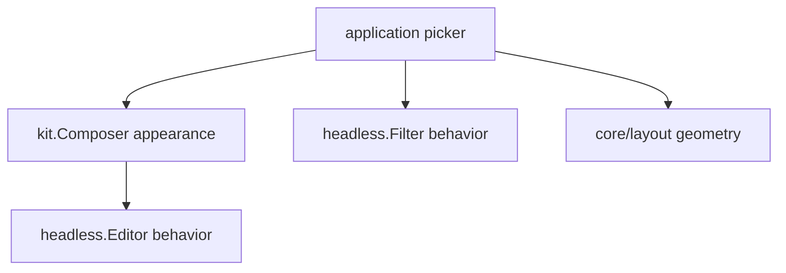

# Compose a themeable picker

Language: English | [简体中文](zh/components.md)

This tutorial turns the core component contract into a reusable interface without
giving product policy to the library. You will combine a text editor, fuzzy filter,
layout, focus, pointer routing, and a terminal-aware theme.

Complete code: [`examples/picker`](https://github.com/Tangerg/oolong/tree/main/examples/picker)

## Before you begin

Finish [Build your first interface](getting-started.md) first. This tutorial assumes
you know how `program.Run`, `Draw`, and `Handle` fit together.

Add the component module beside `core`:

```sh
go get github.com/Tangerg/oolong/core@latest
go get github.com/Tangerg/oolong/components@latest
```

Upgrade both modules together. Oolong modules share one coordinated release version.

## Keep each decision in one layer

The picker is a product component assembled from smaller framework components:



`Filter` owns matching, selection, and scrolling. It does not own the query editor or
the look of a row. The application owns both because only the application knows where
the query belongs and what choosing an item means.

## Resolve terminal facts once

Build appearance from the terminal driven by this runtime. Do not read process
environment variables inside a component because a local session and an SSH session
may describe different terminals.

```go
func newPicker(runtime *program.Runtime, items []string) *picker {
    theme := kit.Suited(runtime.Environment().Ground())
    glyphs := kit.GlyphsFor(runtime.Environment().Locale())

    p := &picker{runtime: runtime, theme: theme}
    p.query = kit.Composer{
        Theme:  theme,
        Prompt: glyphs.Marker + " ",
    }
    p.query.Editor().Placeholder = "type to narrow"
    p.configureItems(items)
    return p
}
```

`Theme` names semantic roles such as `Accent`, `Selection`, and `Danger`. `Glyphs`
answers a different question: which characters this terminal can represent.

## Let the filter own filtering

Configure state-changing behavior through methods. `SetItems`, `SetText`, and
`SetPattern` invalidate the filter's cached ranking, so callers cannot mutate the
source while stale results remain visible.

```go
func (p *picker) configureItems(items []string) {
    p.list = &headless.Filter[string]{
        Row: p.drawRow,
    }
    p.list.SetText(func(item string) string { return item })
    p.list.SetItems(items)
}
```

The row callback is the appearance seam. It receives the item, fuzzy-match offsets,
and selection state. Draw the same behavior with a different shape by replacing this
callback, not by replacing `Filter`.

## Divide the assigned region

A headless widget draws into `headless.Frame`. The frame carries the same clipped
grid view as a core component plus the transaction used for input geometry.

```go
func (p *picker) Draw(frame headless.Frame) {
    rows := frame.Subs((layout.Flow{Axis: layout.Down}).Rects(frame.Bounds().Size(), []layout.Slot{
        {Size: layout.Fixed(1)},
        {Size: layout.Flex(1)},
        {Size: layout.Fixed(1)},
    }))
    p.query.Draw(rows[0])
    p.list.Draw(rows[1])
    kit.Label{
        Text:  fmt.Sprintf("%d of %d", p.list.Matched(), p.list.Len()),
        Style: p.theme.Subtle,
    }.Draw(rows[2].View)
}
```

The application chooses the vertical composition. Neither child needs to know what
is above or below it. Replace the slots with `layout.Across` to make a two-pane
interface without changing either child.

## Route events by ownership

Offer navigation keys to the list and text input to the composer. Handling and
changing are different facts: Backspace is handled at the beginning of an empty
editor but changes nothing. Compare `Editor.Revision` around input to publish the
pattern only when semantic content changed, without guessing from keys or action
names.

```go
func (p *picker) Handle(event input.Event) bool {
    if key, ok := event.(input.Key); ok && key.Down() {
        switch key.Code {
        case input.Enter:
            p.choose()
            return true
        case input.Up, input.Down, input.PageUp, input.PageDown:
            return p.list.Handle(event)
        }
    }
    before := p.query.Editor().Revision()
    handled := p.query.Handle(event)
    if p.query.Editor().Revision() != before {
        p.list.SetPattern(p.query.Text())
    }
    return handled
}
```

For pointer input, stage child rectangles in a `headless.Snapshot` during `Draw` and
route against `Snapshot.Value` in `Handle`. The snapshot becomes visible only after
the complete root frame succeeds, so an event never sees half of a new layout. The
complete picker demonstrates this pattern.

## Install the headless root

`headless.NewRoot` is the only bridge from a live headless tree to
`program.Component`. It commits all nested presentation snapshots atomically.

```go
err := program.Run(context.Background(), program.Config{
    Root: func(runtime *program.Runtime) program.Component {
        return headless.NewRoot(newPicker(runtime, files()))
    },
    Terminal: term.Config{Probe: true, Mouse: true},
})
```

Passive content such as a finished Markdown document does not need this transaction.
Adapt it with `headless.Static` only when placing it inside a live widget tree.

## Change appearance without changing behavior

Copy a theme value and replace semantic roles:

```go
theme := kit.Suited(runtime.Environment().Ground())
theme.Accent = grid.Style{FG: grid.RGBColor(0xD7, 0x8B, 0xFF)}
theme.Selection = grid.Style{BG: grid.RGBColor(0x32, 0x27, 0x3B)}
```

Pass the modified value to kit components. Headless state remains unchanged. For a
fully custom design system, keep `components/headless` and draw every appearance seam
with your own package; `headless` never imports `kit`.

## Run and verify the slice

```sh
go run ./examples/picker
cd examples && go test ./picker
```

You now have the component-level composition model. Continue with
[Render Markdown, code, and mathematics](content.md) to add passive content, or
[Build bounded streaming output](streaming.md) to connect background work.
