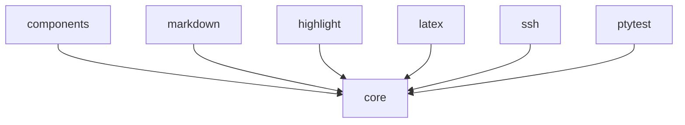

# Choose modules for your interface

Language: English | [简体中文](zh/modules.md)

Oolong uses module boundaries only where dependency sets change. Start with `core`, then add a module when its capability or dependency belongs in your application.

## Select modules by responsibility

This table maps each public module to the reason for importing it:

| Module | Add it when you need | Direct third-party dependencies |
| --- | --- | --- |
| `core` | Terminal ownership, grids, input, text, layout, runtime, or in-process tests | `uniseg`, `go-runewidth`, `x/term`, `x/sys` |
| `components` | Headless behavior, the default theme, or compound components | None beyond `core` |
| `markdown` | Finished or incremental GitHub Flavored Markdown (GFM) | `goldmark` |
| `highlight` | Styled source code | `chroma` |
| `latex` | Selectable terminal mathematics | `go-latex` |
| `ssh` | Oolong over an accepted SSH session | `charm.land/ssh` |
| `ptytest` | Assertions against a real pseudoterminal (PTY) | `x/sys` |

The `examples` and `internal` modules are repository tools. Applications do not import them.

## Install one coordinated version

Install every Oolong module at the same release version. `@latest` resolves the current coordinated release:

```sh
go get github.com/Tangerg/oolong/core@latest
go get github.com/Tangerg/oolong/components@latest
```

Add optional content modules only when imported:

```sh
go get github.com/Tangerg/oolong/markdown@latest
go get github.com/Tangerg/oolong/highlight@latest
go get github.com/Tangerg/oolong/latex@latest
```

Upgrade the complete imported set together. Pre-1.0 releases may change exported APIs, and the [changelog](https://github.com/Tangerg/oolong/blob/main/CHANGELOG.md) records every migration.

## Use common dependency sets

Choose one of these starting sets:

| Application | Modules |
| --- | --- |
| Core-only full-screen or inline interface | `core` |
| Forms, editors, lists, dialogs, or themed components | `core`, `components` |
| Markdown reader | `core`, `markdown` |
| Themed Markdown component | `core`, `components`, `markdown` |
| Agent output with code and mathematics | `core`, `components`, `markdown`, `highlight`, `latex` |
| SSH-hosted interface | The application set plus `ssh` |
| Real terminal integration tests | The application set plus `ptytest` in tests |

An application may use `highlight` or `latex` without Markdown. Their natural entry points return core text or a core drawable.

## Keep dependencies pointing down

The module graph is a directed acyclic graph (DAG):



Optional content modules remain peers. Compose them in the application through core text values; do not create imports between them.

## Verify the consumer graph

The repository uses `go.work`, but consumers do not receive it. Test the graph declared by `go.mod` before publishing an application:

```sh
GOWORK=off go mod tidy -diff
GOWORK=off go test ./...
```

These commands expose missing `require` directives and accidental reliance on unpublished workspace code.

Continue with [Build your first interface](getting-started.md) for `core`, or [Compose a themeable picker](components.md) for the component layer.
