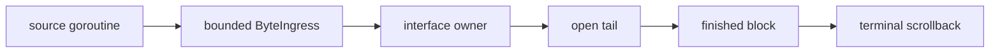

# Build bounded streaming output

Language: English | [简体中文](zh/streaming.md)

This guide connects an ordered background byte source to an inline interface. It
keeps pending input bounded, transforms partial content on the interface owner, and
publishes finished blocks into terminal scrollback.

Use [`examples/streaming`](https://github.com/Tangerg/oolong/tree/main/examples/streaming) as the complete implementation.
The snippets below isolate the ownership boundaries that an application must keep.

## Before you begin

Read [Compose a themeable picker](components.md) for owner-side component state. Read
[Render Markdown, code, and mathematics](content.md) when the source emits Markdown;
plain byte streams do not require an optional content module.

## Keep four lifetimes separate

A streaming interface owns four different states:

1. The source goroutine owns network, process, or model I/O
2. `program.ByteIngress` owns accepted bytes waiting for the interface
3. The interface goroutine owns components and the open transformed tail
4. The terminal owns content after `InlineRuntime.Print` commits it



Only the first edge may block. Backpressure at `ByteIngress.Write` bounds memory
without blocking the interface goroutine or imposing a limit on the runtime's
general dispatcher.

## Define a source at the byte boundary

Keep the producer independent from frames and components:

```go
type replySource func(
    ctx context.Context,
    prompt string,
    dst io.Writer,
) error
```

An HTTP response body, `exec.Cmd.Stdout`, or model stream can implement this shape.
The source must honor `ctx`, preserve byte order, and return the error that ended the
stream.

## Start bounded ingress

Create ingress on the interface goroutine. The limit counts accepted bytes that the
owner has not consumed:

```go
ingress, err := program.NewByteIngress(
    runtime.Dispatcher(),
    64<<10,
    chat.accept,
)
if err != nil {
    chat.finish(err)
    return
}

ctx, cancel := context.WithCancel(context.Background())
chat.ingress = ingress
chat.cancel = cancel

go func() {
    err := chat.source(ctx, prompt, ingress)
    _ = ingress.CloseWithError(err)
}()
```

The producer closes ingress exactly once. `CloseWithError` delivers every accepted
byte before one final batch. If the interface stops first, writes return
`program.ErrStopped` and pending bytes are released.

## Transform only on the owner

The callback runs on the interface goroutine. Update components there without a
mutex:

```go
func (c *chat) accept(batch program.ByteBatch) {
    if len(batch.Data) > 0 {
        c.consumeMarkdown(string(batch.Data))
    }
    if batch.Final {
        c.finish(batch.Err)
    }
}
```

`markdown.Stream.Feed` separates stable blocks from the open tail. Append stable
blocks once. Replace only the open document while more bytes can still change it.
Call `Flush` when the final batch arrives.

## Publish finished ownership

Keep a bounded number of finished blocks in the live transcript for selection and
search. Commit older blocks with the transcript renderer's publication operation.
That operation measures and prints the same drawable, then releases its interactive
identity.

Do not rebuild published rows in application state. The terminal already owns them,
and rebuilding them would make memory and resize work grow with session age.

## Settle cancellation and failure

Cancellation is a source result, not a second delivery path:

- Cancel the source context from the interface owner
- Let the source return `context.Canceled`
- Close ingress with that result
- Settle UI state from the final `ByteBatch`
- Wait on `ByteIngress.Done` when another goroutine must release source resources

Treat a terminal write failure separately from a source failure. The source may have
completed successfully even when presentation could not finish.

## Verify the complete path

Test owner-side state with `programtest`. Add a PTY test for permanent publication,
idle output, resize, and terminal mode cleanup. The [testing guide](testing.md)
defines both boundaries. Continue with [Build a bounded agent interface](agent.md)
to add typed domain events and tool review around this byte path.
