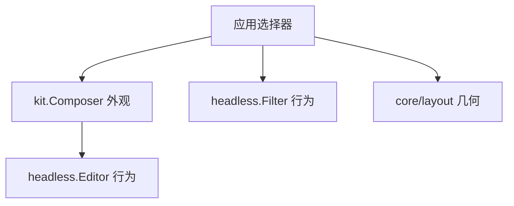

# 组合一个可换主题的选择器

语言：[English](../components.md) | 简体中文

本教程把核心组件契约扩展成可复用的界面，同时不把产品策略交给库。你将组合文本编辑器、
模糊过滤、布局、焦点、指针路由和适配终端的主题。

完整代码：[`examples/picker`](https://github.com/Tangerg/oolong/tree/main/examples/picker)

## 开始之前

请先完成[构建第一个界面](getting-started.md)。本教程假定你已经理解
`program.Run`、`Draw` 和 `Handle` 如何配合。

在 `core` 之外添加组件模块：

```sh
go get github.com/Tangerg/oolong/core@latest
go get github.com/Tangerg/oolong/components@latest
```

请同步升级这两个模块。Oolong 的模块共享同一个协调发布版本。

## 让每一层只决定一件事

选择器是由较小的框架组件组合出的产品组件：



`Filter` 拥有匹配、选择和滚动，但不拥有查询编辑器或行的外观。应用必须拥有后两者，
因为只有应用知道查询应该放在哪里，以及选中一个项目意味着什么。

## 一次性解析终端事实

从当前运行时所驱动的终端构造外观。不要在组件内读取进程环境变量，因为本地会话与 SSH
会话可能描述不同的终端。

```go
func newPicker(runtime *program.Runtime, items []string) *picker {
    theme := kit.Suited(runtime.Environment().Ground())
    glyphs := kit.GlyphsFor(runtime.Environment().Locale())

    p := &picker{runtime: runtime, theme: theme}
    p.query = kit.Composer{
        Theme:  theme,
        Prompt: glyphs.Marker + " ",
    }
    p.query.Editor().Placeholder = "type to narrow"
    p.configureItems(items)
    return p
}
```

`Theme` 命名 `Accent`、`Selection` 和 `Danger` 等语义角色。`Glyphs` 回答另一个问题：
这个终端能够表示哪些字符。

## 让过滤器拥有过滤行为

通过方法配置会改变状态的行为。`SetItems` 将值与“如何将值读成文本”的投影作为同一
数据源一起替换，`SetPattern` 再收窄该数据源。两者都会使缓存的排序失效，因此不存在
数据与投影不一致的中间状态，也不会让过时结果继续可见。

```go
func (p *picker) configureItems(items []string) {
    p.list = &headless.Filter[string]{
        Row: p.drawRow,
    }
    p.list.SetItems(items, func(item string) string { return item })
}
```

行回调是外观接缝。它会收到项目、模糊匹配偏移和选中状态。若要用另一种形状绘制同一
行为，请替换这个回调，而不是替换 `Filter`。

## 绘制被动图表

图表是已完成内容，不是控制器。`Sparkline` 与 `BarChart` 直接绘制到 `grid.View`，实现
`headless.Block`，但不拥有选择、时钟或历史。应用继续持有测量数据，并决定它们何时
变化。

```go
trend := kit.Sparkline{
    Theme: theme, Glyphs: glyphs,
    Values: []float64{0.12, 0.18, 0.15, 0.24, 0.31},
    Minimum: 0, Maximum: 1,
}

usage := kit.BarChart{
    Theme: theme, Glyphs: glyphs, Maximum: 100,
    Bars: []kit.Bar{
        {Label: "CPU", Value: 42, Text: "42%"},
        {Label: "RAM", Value: 68, Text: "68%"},
    },
}
```

Sparkline 使用能够放入视口的最新样本。有效的 `Minimum`/`Maximum` 组合会固定量程，
完成度与资源指标通常需要这种语义；两个字段取零时则从可见窗口推导刻度。BarChart
有意只做水平、非负图表：它解决带标签的仪表盘比较，而不引入坐标轴、画布或约束
求解器。任一图表都可以通过 `headless.Static`、转录区、面板正文或应用自己的布局进行组合。

## 划分已分配的区域

无外观组件绘制到 `headless.Frame`。它既携带核心组件使用的裁剪后网格视图，也携带
输入几何所需的事务。

```go
func (p *picker) Draw(frame headless.Frame) {
    rows := frame.Subs((layout.Flow{Axis: layout.Down}).Rects(frame.Bounds().Size(), []layout.Slot{
        {Size: layout.Fixed(1)},
        {Size: layout.Flex(1)},
        {Size: layout.Fixed(1)},
    }))
    p.query.Draw(rows[0])
    p.list.Draw(rows[1])
    kit.Label{
        Text:  fmt.Sprintf("%d of %d", p.list.Matched(), p.list.Len()),
        Style: p.theme.Subtle,
    }.Draw(rows[2].View)
}
```

应用决定纵向组合，两个子组件都不需要知道上下还有什么。把槽位改为 `layout.Across`
即可得到双栏界面，无需修改任何子组件。

## 按所有权路由事件

把导航键交给列表，把文本输入交给编辑器。“已处理”与“已改变”是两个事实：在空编辑器
开头按 Backspace 会被处理，但不会改变任何内容。在输入前后比较 `Editor.Revision`，只在
语义内容真的变化时发布过滤模式，无需根据按键或 action 名称猜测。

```go
func (p *picker) Handle(event input.Event) bool {
    if key, ok := event.(input.Key); ok && key.Down() {
        switch key.Code {
        case input.Enter:
            p.choose()
            return true
        case input.Up, input.Down, input.PageUp, input.PageDown:
            return p.list.Handle(event)
        }
    }
    before := p.query.Editor().Revision()
    handled := p.query.Handle(event)
    if p.query.Editor().Revision() != before {
        p.list.SetPattern(p.query.Editor().Text())
    }
    return handled
}
```

对于指针输入，请在 `Draw` 期间把子区域暂存到 `headless.Snapshot`，再在 `Handle` 中根据
`Snapshot.Value` 路由。快照只会在完整根帧成功后变为可见，所以事件永远不会看到一半
新、一半旧的布局。完整选择器演示了这一模式。

## 安装无外观根节点

`headless.NewRoot` 是从实时无外观树到 `program.Component` 的唯一桥梁。它会原子交付
所有嵌套的呈现快照。

```go
err := program.Run(context.Background(), program.Config{
    Root: func(runtime *program.Runtime) program.Component {
        return headless.NewRoot(newPicker(runtime, files()))
    },
    Terminal: term.Features{Probe: true, Mouse: true},
})
```

`program.Config.Terminal` 只接受可选的 `term.Features`。`Root` 已经表示拥有备用屏幕，
`Inline` 已经表示使用终端普通屏幕，因此不存在需要保持一致的第二个 `AltScreen` 开关。
传输适配器在取得底层终端会话时使用 `program.Config.TerminalConfig()`。

已完成的 Markdown 文档等被动内容不需要该事务。只有在把它放进实时组件树时，才使用
`headless.Static` 适配。

## 在不改变行为的前提下换外观

复制主题值并替换语义角色：

```go
theme := kit.Suited(runtime.Environment().Ground())
theme.Accent = grid.Style{FG: grid.RGBColor(0xD7, 0x8B, 0xFF)}
theme.Selection = grid.Style{BG: grid.RGBColor(0x32, 0x27, 0x3B)}
```

把修改后的值传给 kit 组件，无外观状态不会改变。若要构建完全自定义的设计系统，请保留
`components/headless`，并用自己的包绘制每个外观接缝；`headless` 永远不会导入 `kit`。

## 明确值身份与导航意图

受控字段通过 accessor 提交编辑。在安装选项前设置 `Select.Same` 或
`MultiSelect.Same`；普通可比较值可以使用 `headless.Equal[T]`。标签只负责显示，
翻译标签不会改变选中值的身份。`Chosen`、`Taken` 和 `Ask` 只投影状态；调用 `Sync`
可显式同步外部变更，输入和校验也会经过同步边界。

`Text` 直接提供文本、光标、遮罩、剪贴板、行旁装饰和光标样式。通过 `SetText`、
`SetCursor`、`Handle` 或 `Do` 编辑，使结果经过 accessor 的接受规则。
`Text` 不再暴露内部 Editor。`kit.Composer` 是编辑器的外观包装，仍然公开它的 Editor。

列表选择变化和 Editor 光标导航都只请求显示一次。`Scroll.Reveal` 会保留到完整帧提交，中断绘制不会丢失请求。
后续手动滚动优先，`Scroll.FollowingEnd` 表示跟随末尾的策略。
`kit.Transcript.Current` 只改变匹配高亮，跳转请调用 `RevealMatch(index)`。
Editor 请求在下一帧的实际换行宽度下解析；已完成导航后的尺寸变化保留手动滚动位置。
Filter 查询重置会回到第一个结果。

容器中的孩子需要移动时，应设置稳定 Key 并保留同一组件实例。`FocusIndex` 接受当前集合
索引；指针输入按已呈现的实例身份定位，移除或替换孩子后不会把旧点击或捕获交给新实例。
需要跨 `Set` 保持身份的组件应使用指针。

每个控件拥有自己的 `Pointer`。Draw 中调用 `Stage(frame, area)`；事件处理中调用
`Handle` 和 `Clicked(button)`。绘制只读取 `Over()`、`Pressing()`，快速按下再松开
不需要中间绘制一帧。`PointerRegion` 根据孩子的连续呈现生命周期路由：孩子消失后重新
出现，也不会接回旧手势。Tabs 和 Viewport 使用同一规则。

`List.SetItems` 后，鼠标选择等待新集合完成绘制。自定义页签条用
`Tabs.SelectPresented(index)` 处理已提交页签条上的点击；`Tabs.Select(index)`
仍然用于当前集合中的程序导航。修改按键绑定会取消未完成序列；替换选项集合或模态层时，
新对象不会继承延迟动作。Settings 的值编辑始终属于开始该按键序列时的那一行。

`Completion.Renderer` 同时提供 `DrawRow` 与 `Width`，可以替换完整候选行布局。
`Select.Row` 和 `MultiSelect.Row` 可自定义单行选项。外部字段实现
`ThemedField.DrawWith` 后，就能通过与内置字段相同的通道接收该帧的 Form 外观。

## 运行并验证这个切片

```sh
go run ./examples/picker
cd examples && go test ./picker
```

现在你已经掌握组件层组合模型。接下来可以阅读
[渲染 Markdown、代码与数学公式](content.md)以添加被动内容，或阅读
[构建有界流式输出](streaming.md)以连接后台工作。
