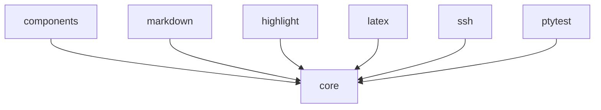

# 为界面选择模块

语言：[English](../modules.md) | 简体中文

Oolong 只在依赖集合发生变化时建立模块边界。请从 `core` 开始，只在应用确实需要某项能力或依赖时添加对应模块。

## 按职责选择模块

下表把每个公开模块映射到它的导入理由：

| 模块 | 需要这些能力时添加 | 直接第三方依赖 |
| --- | --- | --- |
| `core` | 终端所有权、网格、输入、文本、布局、运行时或进程内测试 | `uniseg`、`go-runewidth`、`x/term`、`x/sys` |
| `components` | Headless 行为、默认主题或复合组件 | 除 `core` 外没有 |
| `markdown` | 已完成或增量的 GitHub Flavored Markdown (GFM) | `goldmark` |
| `highlight` | 带样式的源码 | `chroma` |
| `latex` | 可选择的终端数学公式 | `go-latex` |
| `ssh` | 在已接受的 SSH 会话中运行 Oolong | `charm.land/ssh` |
| `ptytest` | 针对真实伪终端 (PTY) 断言 | `x/sys` |

`examples` 与 `internal` 是仓库工具模块，应用不应导入它们。

## 安装同一个协调版本

请把所有 Oolong 模块安装到同一个发布版本。`@latest` 会解析当前协调发布：

```sh
go get github.com/Tangerg/oolong/core@latest
go get github.com/Tangerg/oolong/components@latest
```

只在导入时添加可选内容模块：

```sh
go get github.com/Tangerg/oolong/markdown@latest
go get github.com/Tangerg/oolong/highlight@latest
go get github.com/Tangerg/oolong/latex@latest
```

请同步升级应用导入的完整模块集合。1.0 之前的发布可能修改导出 API，[变更日志](https://github.com/Tangerg/oolong/blob/main/CHANGELOG.md)会记录每次迁移。

## 使用常见依赖组合

从以下组合中选择：

| 应用 | 模块 |
| --- | --- |
| 只使用核心的全屏或内联界面 | `core` |
| 表单、编辑器、列表、对话框或主题化组件 | `core`、`components` |
| Markdown 阅读器 | `core`、`markdown` |
| 主题化 Markdown 组件 | `core`、`components`、`markdown` |
| 包含代码和数学公式的 Agent 输出 | `core`、`components`、`markdown`、`highlight`、`latex` |
| 通过 SSH 托管的界面 | 应用模块集合加 `ssh` |
| 真实终端集成测试 | 应用模块集合加测试中的 `ptytest` |

应用可以脱离 Markdown 独立使用 `highlight` 或 `latex`。它们的自然入口返回核心文本或核心 drawable。

## 保持依赖向下

模块图是有向无环图 (DAG)：



可选内容模块彼此平级。请在应用中通过核心文本值组合它们，不要在它们之间建立 import。

## 验证消费方依赖图

仓库使用 `go.work`，但消费方不会得到它。发布应用之前，请测试 `go.mod` 真正声明的依赖图：

```sh
GOWORK=off go mod tidy -diff
GOWORK=off go test ./...
```

这些命令会暴露缺失的 `require` 指令，以及对未发布工作区代码的意外依赖。

接下来阅读[构建第一个界面](getting-started.md)以使用 `core`，或阅读[组合一个可换主题的选择器](components.md)以使用组件层。
